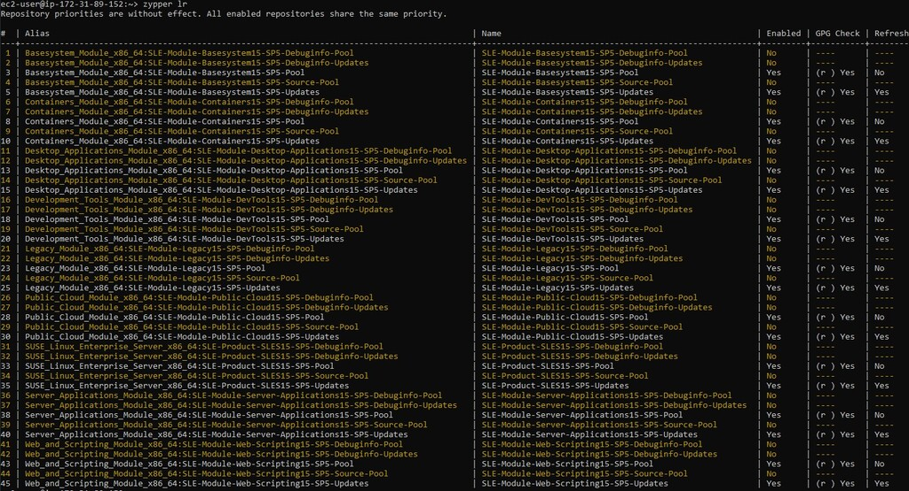

<!--
Copyright Amazon.com, Inc. or its affiliates. All Rights Reserved.
SPDX-License-Identifier: MIT-0
-->

Modules are the building blocks/features that create the product that best fits your needs. Each module comes with a set of online repositories that contain the packages necessary to run and maintain the feature. Many modules already include the SUSE Linux Enterprise Server subscription. You have the option to subscribe to additional modules (known as [extensions](https://documentation.suse.com/sles/15-SP6/html/SLES-all/article-modules.html)), based on your needs. You can decide what to activate/deactivate from the pool of available modules to create the product that best fits those needs.

### SUSE Modules (SLE15)
Modules allow you to shape the deployment according to your needs.

| Modules (included with subscription) | Description |
|--------|--------|
| Basesystem | SLE base system |
| Server Application | Basic server functionality, NVDIMM support, OFED |
| Desktop Application | Basic desktop functionality |
| Development Tools | Helps in developing applications, replaces the SLE SDK |
| Web & Scripting | Additional Web server functionality |
| Public Cloud | Public cloud initialization code and tools |
| Containers | Docker, tools, prepackaged images |
| Transactional Server | Atomic update method |

### SUSE Extensions (SLE15)
Extensions provide advanced capabilities and are offered as subscriptions that require an additional registration key that is liable for costs.

| Package Hub Extensions (require subscription key) | Description |
|--------|--------|
| SAP Applications | Packages specific to SLES for SAP |
| High Performance Computing | Tools and libraries related to High Performance Computing |
| Workstation Extension | Office tools and multimedia |
| High Availability | HA tools such as Hawk, crm, Pacemaker, Corosync |
| SUSE Manager | Manage security and compliance for entire network of SUSE instances|
| Live Patching | Apply patches/updates without rebooting |

::alert[Modules and extensions will vary slightly between different OS versions, but most will remain consistent.]{header="Modules for Different Versions"}

When using Pay-as-you-go (PAYG), all modules are activated by default, though not all are enabled. You can see these modules by running the following command.

`zypper lr`

