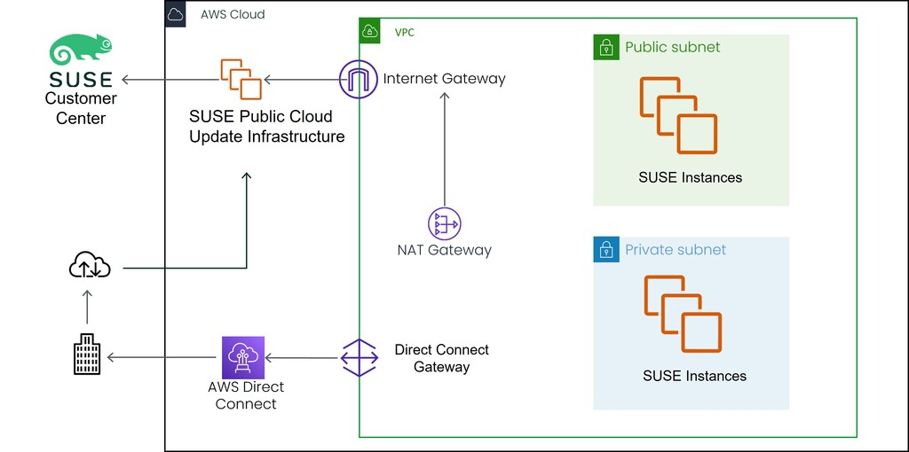

<!--
Copyright Amazon.com, Inc. or its affiliates. All Rights Reserved.
SPDX-License-Identifier: MIT-0
-->

#### Summary of the Public Cloud Update Infrastructure (PCUI)

Customers have two choices when deciding how to handle updates for the SUSE Linux Enterprise Server instances. They can create and maintain a private repository of patches and updates to which they can connect their SLES instances. Or they can choose to use the Public Cloud Update Infrastructure (PCUI). The PCUI is designed to provide low latency updates to SUSE customers, both BYOS and PAYG. It is comprised of region and update servers, and is maintained by SUSE on the AWS cloud. When customers are looking to connect to the update infrastructure, their instance contacts the region server. The instance then receives back the information for the update servers. From there, it registers with the update server local to its region and is ready to go.

#### Benefits of Using PCUI

Using the Public Cloud Update Infrastructure comes with many benefits:

1. Easy connection to the PCUI and PAYG instances connect automatically
2. Low latency updating due to ability to patch within the AWS infrastructure,
quicker than pulling patches from a content delivery network
3. No need for customer-maintained upgrade or patch repositories
4. PCUI is protected by SUSE High Availability (HA) Technology, making it resilient
and highly available

#### Connecting to the PCUI from an AWS Pay-as-you-go (PAYG) SLES Instance

To connect to the update infrastructure from your instance, the instance must be able to connect to the SUSE infrastructure. For public instances this is easily accomplished through their route to an internet gateway. However, in the graphic below, the private instances can connect in one of two ways. The more common path is through a NAT gateway positioned in a public subnet, that the private instances can use to then go through the internet gateway to the SUSE PCUI. Alternatively, the private instances can use a Direct Connect gateway to travel through the AWS infrastructure to connect to the SUSE PCUI.

Once the instance(s) are connected to the SUSE update infrastructure, they follow the process outlined below to register with the appropriate servers.

