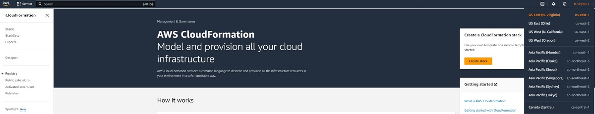
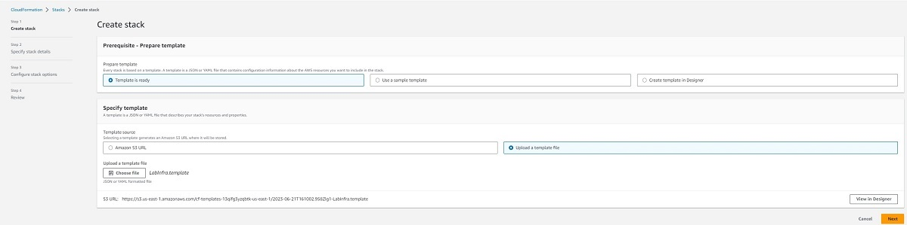
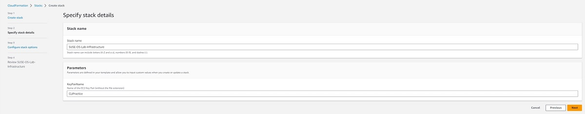
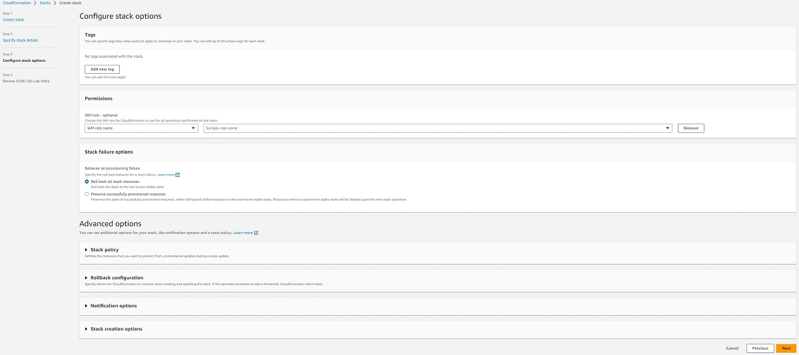
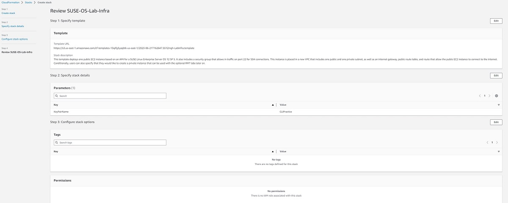
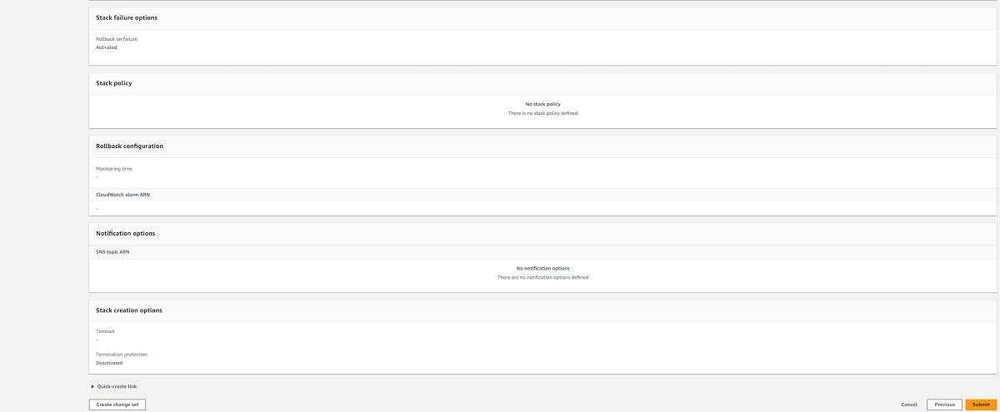
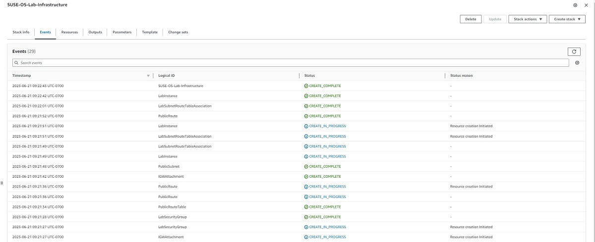

<!--
Copyright Amazon.com, Inc. or its affiliates. All Rights Reserved.
SPDX-License-Identifier: MIT-0
-->

Using this tutorial, you will set up a reusable automation template within [AWS CloudFormation](https://us-east-1.console.aws.amazon.com/cloudformation/home?region=us-east-1#/). This is quicker than manually provisioning your architecture, and allows you to easily provision/deprovision your architecture between labs if you are unable to do them all at once.

We will use our own customized AWS CloudFormation template to create the architecture we need to carry out the rest of the labs, including a public EC2 instance launched from a PAYG SLES Amazon Machine Image (AMI). This instance will be running OS version 12, Service Pack 12 which allows us run upgrades in the upcoming labs.

### Activity 1: Create a CloudFormation Stack

#### Step 1: Navigate to the CloudFormation Home Page

First navigate to [AWS CloudFormation](https://us-east-1.console.aws.amazon.com/cloudformation/home?region=us-east-1#/) in the [AWS console](https://us-east-1.console.aws.amazon.com/console/home?region=us-east-1). Once there, make sure that you are in the North Virginia region, as our template is setup to work in that region specifically. You can find what region you are by checking the top right corner of the console, and if needed you can select that region and pick us-east-1 from the drop-down menu. 

#### Step 2: Create the Stack

We will now create a stack in CloudFormation. In the right menu, click on **Create stack**.

On the first page, select the following options:

- Template is ready
- Upload a template file

Next, download the lab template file from this link :link[CloudFormation Template]{href="/static/setup/LabInfra.yaml" action=download}, upload it as the template file for our stack, and click **Next**.

On the next page fill in the following values:

- Stack name: SUSE-OS-Lab-Infrastructure
- Fill in the name of the keypair that you wish to use. If you do not already have a key pair, you will need to create one through the AWS console. 
    - Make sure that you just put the file name, and not the file extension. For example, it would be keypair, not keypair.pem
    - If you need to create and download your own keypair, you can follow this guide: [How to Create a key pair in the AWS Console](https://docs.aws.amazon.com/AWSEC2/latest/UserGuide/create-key-pairs.html#having-ec2-create-your-key-pair)
- Leave the instance type as the default (t2.micro)
::alert[If the stack fails to create because the instance type is unavailable, you can select one of the other options such as t2.small and re-run the create.]

Then proceed to the next page by clicking **Next**.

On the next page you can leave all of the default settings. It is worth noting that in the case of a stack failure CloudFormation will automatically roll back/deprovision any resources that it created. Hit **Next** and proceed to the final page where you can review the settings you chose in the past three steps. After checking to ensure that everything looks correct, hit **Submit** to create the stack.

::expand[**Configure Stack Options** **Review Page**]{header="Default Settings Examples"}

Your infrastructure should now successfully create!

### Troubleshooting

If your stack fails to create and your architecture is rolled back, you can investigate in the following ways:

- Go to the events for your stack, and find the first resource that failed to create. It will typically give a short description of what went wrong, which will give you a good starting point.
- An easy mistake to make is to specify the full name of your keypair file. For example, if you enter "keypair.pem", your stack will fail to create. Instead enter just the file name "keypair".

**[**Proceed to Task 2**](./check-connectivity.md)**

