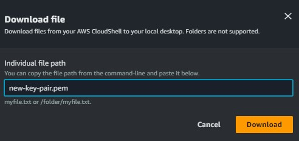

<!--
Copyright Amazon.com, Inc. or its affiliates. All Rights Reserved.
SPDX-License-Identifier: MIT-0
-->

When participating in workshop during an event, you will have access to an AWS account with the workshop architecture already provisioned for you. However,
you will need to download the keypair file that will be used to gain ssh access on the EC2 instance running the SUSE Linux Enterprise Server. You also have to adjust the Security Group to allow incoming SSH connections from your public ip address.

### Activity 1: Download the Key Pair File

#### Step 1: Access the Event AWS Account

From the workshop you should see a link to the event AWS account titled "Open AWS console". 

Click that link, and you will be taken to the console home. 

#### Step 2: Use CloudShell to Download the Instance Key Pair File

From the console home, navigate to [AWS Cloud Shell](https://us-east-1.console.aws.amazon.com/cloudshell/home?region=us-east-1#) by searching for it in the search bar at the top of the screen.

Once the environment has loaded, run the following command to get the ID of the key pair:

:::code{showLineNumbers=true}
aws ec2 describe-key-pairs --filters Name=key-name,Values=new-key-pair --query KeyPairs[*].KeyPairId --output text
:::

The output should be similar to what is shown below.
:::code{showCopyAction=false showLineNumbers=true}
[cloudshell-user@ip-10-6-112-201 ~]$ aws ec2 describe-key-pairs --filters Name=key-name,Values=new-key-pair --query KeyPairs[*].KeyPairId --output text
key-0ffe195c5982224e3
:::

Using the ID that it gives you to replace "key-05abb699beEXAMPLE", run this command to get the parameter for your key and save the key material in a .pem file.

:::code{showLineNumbers=true}
aws ssm get-parameter --name /ec2/keypair/key-05abb699beEXAMPLE --with-decryption --query Parameter.Value --output text > new-key-pair.pem
:::

Run the `ls` command to ensure that the file was saved to your current folder:

:::code{showLineNumbers=true}
ls
:::

:::code{showCopyAction=false showLineNumbers=true}
[cloudshell-user@ip-10-6-112-201 ~]$ aws ssm get-parameter --name /ec2/keypair/key-0ffe195c5982224e3 --with-decryption --query Parameter.Value --output text > new-key-pair.pem
[cloudshell-user@ip-10-6-112-201 ~]$ ls
new-key-pair.pem
:::

Next, from the "Actions" dropdown menu in the top right, select Download file and enter new-key-pair.pem as the file path. Once it has successfully downloaded, you can move on to the next task.

### Activity 2: Add your public ip address to the Security Group

#### Step 1: Get your public IP

Open https://checkip.amazonaws.com/ in your Browser and copy the IP address.

#### Step 2: Add a Rule to the `LabSecurityGroup` Security Group

From the console home, navigate to [EC2](https://us-east-1.console.aws.amazon.com/ec2/home?region=us-east-1#SecurityGroups:) and choose `Security Groups` under `Network & Security` in the left menu. 
Select the Security Group `LabSecurityGroup`, navigate to the tab `Inbound rules` and select `Edit inbound rules`. 
Choose `SSH` in the field `Type`. Enter the IP Address from the previous step in the `Source` text field. Select `Save rules`.

**Proceed to Task 2**

