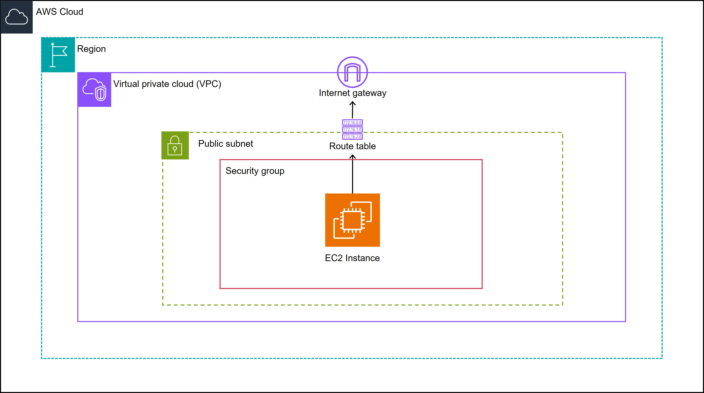

<!--
Copyright Amazon.com, Inc. or its affiliates. All Rights Reserved.
SPDX-License-Identifier: MIT-0
-->

#### Prerequisites Checklist
- AWS Infrastructure Requirements for Labs 1-4 (note: many of the following can be satisfied with the default AWS setup)
    - VPC
    - Public Subnet
    - Internet Gateway
    - Routing Table
    - Security Group
    - Key Pair
    - Public Instance
- Workstation to access the environment, including a browser and Terminal session.

#### Event Login
If you are participating in this workshop as part of an event, your event facilitator will provide you with an event code or sign-on link. If you were given a code, then go to the [workshop website](https://catalog.workshops.aws/join) and enter your event code. Otherwise, click the link you were provided. Accept the terms and conditions, and click **Join event**. 

Once your event facilitator has started the event, you will be able to see the workshop content, as well as your event AWS account access in the bottom left corner. Click on **Open AWS console** and you will be taken to the AWS console home. Once there, you are ready to proceed with the rest of the workshop!

#### Next Steps:
You can choose either one of tasks 1 a), 1 b), or 1 c) to complete the infrastructure setup. Task 1 d) is reserved for delegates who are participating in this workshop via an event.

1 a) walks you through the process of manually provisioning the architecture, and is better for understanding the configuration settings of our SUSE Linux instance.

1 b) is quicker and uses a CloudFormation template to provision the architecture.

1 c) still uses a CloudFormation template, but introduces the user to the AWS Service Catalog and how to create a product that can be provisioned/deprovisioned with the click of a button.

1 d) is reserved for delegates who are using an event provisioned AWS account, and provides instructions on how to download the key pair necessary for them to connect to the lab EC2 instance.

::alert[If you are unable to complete the labs for any reason, please clean up/terminate any resources from the AWS console to avoid possible charges by following the instructions in [Lab 05. Cleanup](../../lab05-cleanup)]