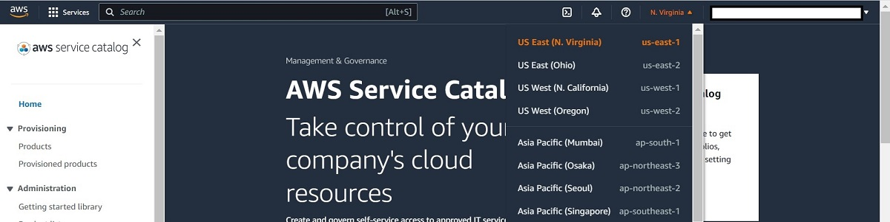
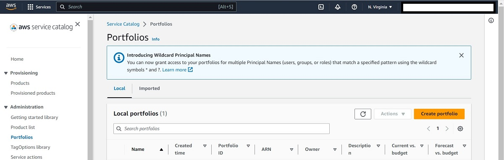
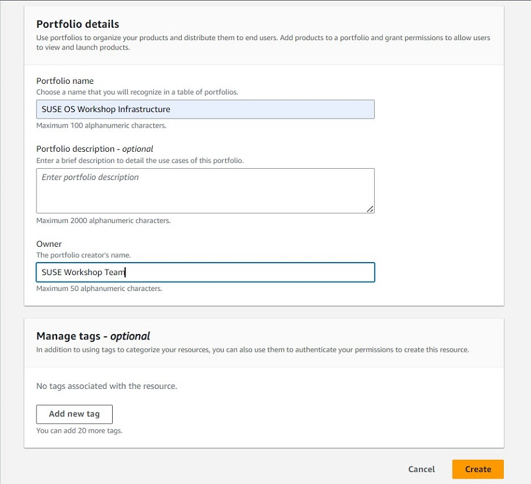
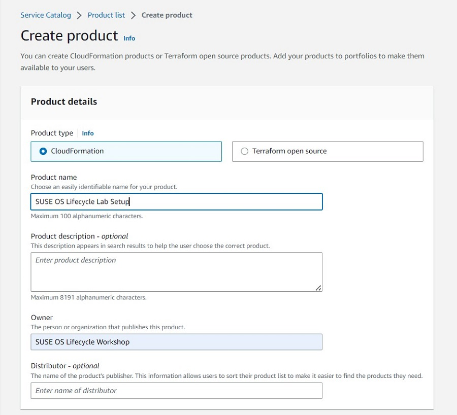
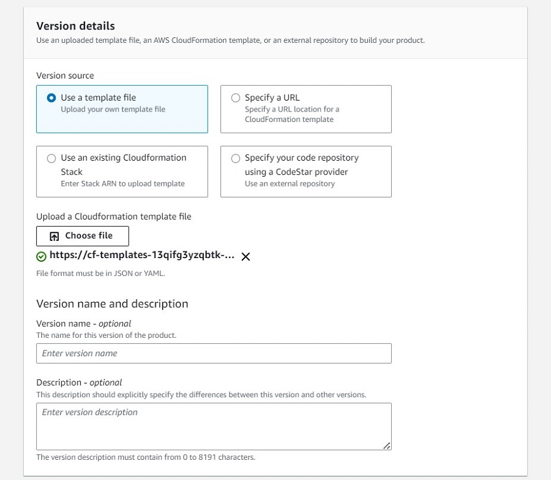
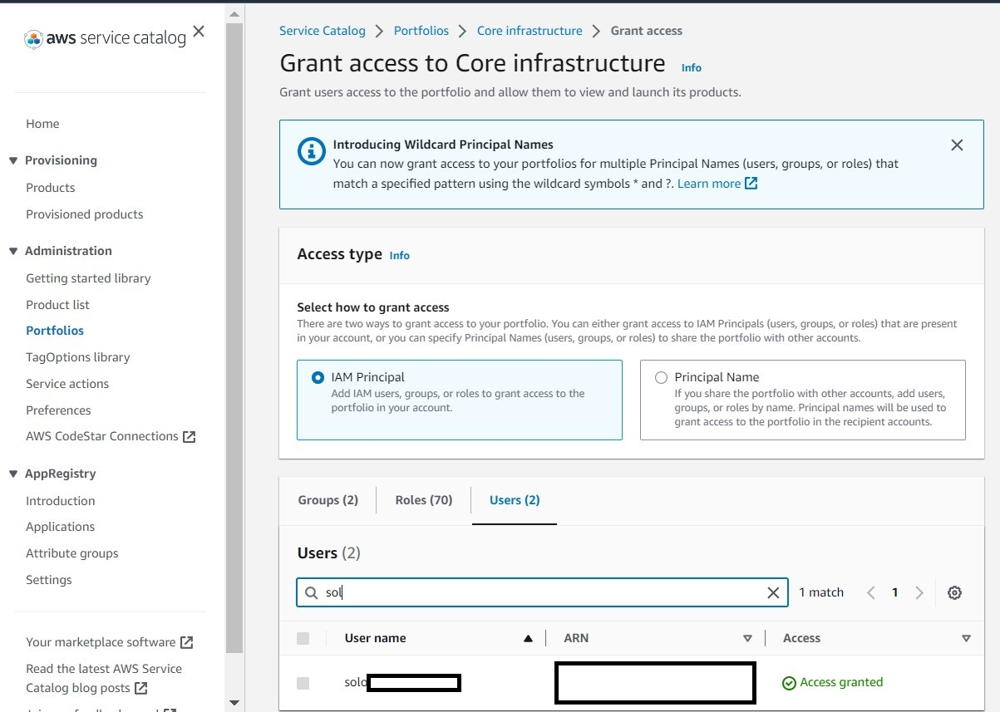
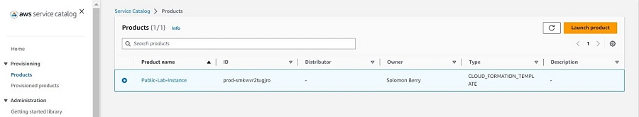
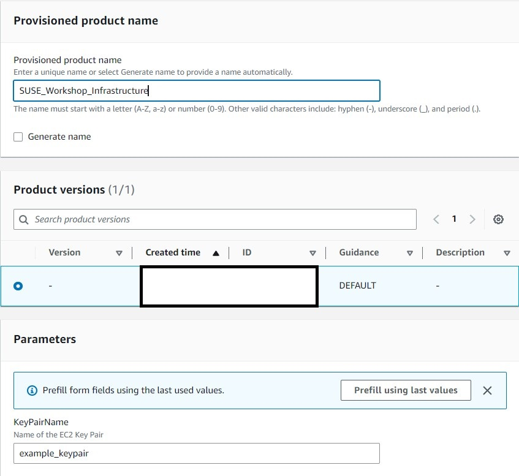

<!--
Copyright Amazon.com, Inc. or its affiliates. All Rights Reserved.
SPDX-License-Identifier: MIT-0
-->

Using this tutorial, you will set up a reusable automation template within [AWS Service Catalog](https://aws.amazon.com/servicecatalog/). This is quicker than manually provisioning your architecture, and allows you to easily provision/deprovision your architecture between labs if you are unable to do them all at once.

With the Service Catalog we can use our own customized AWS CloudFormation template to create and launch a product that provisions the architecture we need to carry out the rest of the labs.

### Activity 1: Create a Service Catalog Portfolio

#### Step 1: Navigate to the Service Catalog

First navigate to the [AWS Service Catalog](https://us-east-1.console.aws.amazon.com/servicecatalog/home?region=us-east-1#home) in the [AWS console](https://us-east-1.console.aws.amazon.com/console/home?region=us-east-1). Once there, make sure that you are in the North Virginia region, as our template is setup to work in that region specifically. You can find what region you are by checking the top right corner of the console, and if needed you can select that region and pick `us-east-1` from the drop-down menu. 

#### Step 2: Create the Portfolio

We will now create a Portfolio in Service Catalog. In the left menu, click on Portfolios under Administration. Then click on **Create portfolio**.

For the Create portfolio settings, fill in the following values, and then click on **Create**.

- Portfolio name: SUSE OS Workshop Infrastructure Templates

- Owner: Linux Team

### Activity 2: Create and Launch our Infrastructure as a Product

You should now be able to see the portfolio under Local portfolios. Move to the portfolio details by clicking on the portfolio name.

#### Step 1: Create our Infrastructure Product

You should now see the details panel for the portfolio that we just created. The next step is to add our product into the portfolio so that we can use it to provision the resources needed for the workshop.

Next, let's add a Product for creating our lab infrastructure by clicking **Create Product**.

- Under Product details, set the Product type to CloudFormation.

- Under the Product details section fill in the below values and leave the rest of the values to their defaults.

    - Product name: SUSE Linux Enterprise Server
    - Owner: Linux Team

- Under the Version details section, select Use a template file. Then download the file from this link :link[Cloud Formation Template]{href="/static/setup/LabInfra.yaml" action=download}. Back on the AWS console, click the Choose file option, and select the template that you just downloaded. 

- Once you have uploaded the file and made sure that the settings are correct, click on **Create Product** at the bottom of the page.

#### Step 2: Grant Access to the Product

Once you are back to the infrastructure Portfolio details page, you should be able to see the newly created product. If not, try clicking on the refresh button. However, before we are able to actually use the product, we will need to grant access to it. To do so, click on the Access tab and then click the **Grant access** button.

On the Grant access page, leave the Access type as is, and click on the Roles or Users tab (depending on how you are accessing this AWS account), and then search for your specific role or user. Next check the box next to your User or Role, and click on the **Grant access** button.

::alert[It is best practice to avoid using the root user or a role with admin permissions for everyday tasks. If you would like to create a new user with only the privileges needed to complete this workshop, you can follow Step 7 of this [user guide](https://docs.aws.amazon.com/singlesignon/latest/userguide/getting-started.html) on getting started with the IAM Identity Center. Any user used for this lab will need the following permissions: AmazonEC2FullAccess, AmazonS3FullAccess, AmazonSSMFullAccess, AWSCloudFormationFullAccess, AWSMarketplaceManageSubscriptions (for the optional Marketplace live patching lab), and AWSServiceCatalogAdminFullAccess.]

#### Step 3: Launch the Product

Now that we've added access, let's see the Products we've added. In the left panel, click on Products, under the Provisioning group. You should see our Products that we created, listed here. It is now ready for use to provision more resources by clicking on it, and selecting **Launch Product**.

In the launch settings, name your product.

In the parameters section:

1. Fill in the name of the keypair that you wish to use. If you do not already have a key pair, you will need to create one through the AWS console. 
    - Make sure that you just put the name, and not the file extension. So it would be keypair, not keypair.pem
    - If you need to create and download your own keypair, you can follow this guide: [How to Create a key pair in the AWS Console](https://docs.aws.amazon.com/AWSEC2/latest/UserGuide/create-key-pairs.html#having-ec2-create-your-key-pair)
2. Leave the instance type as the default (t2.micro) 
::alert[If the stack fails to create because the instance type is unavailable, you can select one of the other options such as t3.micro or t2.small and re-run the launch.]

Then click **Launch Product**

Your infrastructure should now successfully create!

**Proceed to Task 2**

