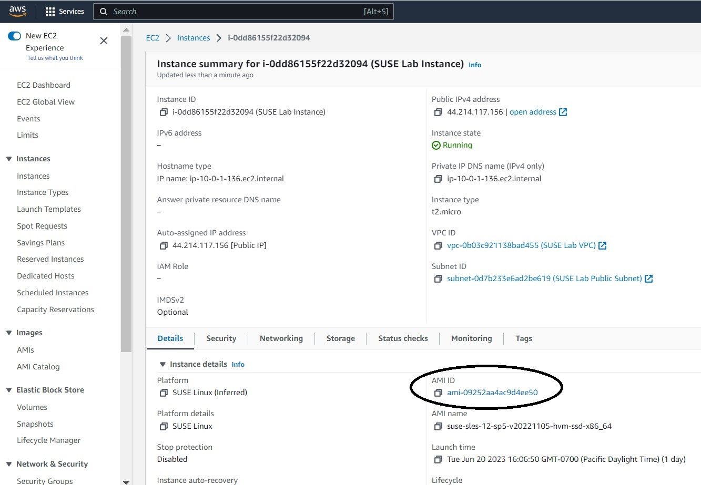

<!--
Copyright Amazon.com, Inc. or its affiliates. All Rights Reserved.
SPDX-License-Identifier: MIT-0
-->

One of the main tools for exploring and viewing update server and image data within AWS is the PINT tool from SUSE. In this lab we will install PINT and use it to view data about SUSE’s Public Cloud Update Infrastructure. With PINT we will explore and view the SUSE update servers and published images.

### Activity 1: Connect to the instance and activate the SUSE Public Cloud Repository

#### Step 1: Establish an SSH Session
If not already connected, establish a ssh terminal session to your running Lab instance use the preferred method.

#### Step 2: Activate Public Cloud Repository in SCC
SUSE offers multiple repositories in which additional packages are available.  In order to install packages from a module, the module must be enabled.  

**💡 TIP**\
Since we are using a PAYG instance and SUSE’s Public Cloud Update Infrastructure in this workshop, these additional modules are automatically enabled on system boot.

The first step is to see which modules are currently activated on the SLES instance, for this we use the SUSEConnect tool.
:::code{showLineNumbers=true}
sudo SUSEConnect --list-extensions
:::

The results should look similar to the following:

:::code{showCopyAction=false showLineNumbers=true}
ec2-user@ip-172-31-17-181:~> sudo SUSEConnect --list-extensions
AVAILABLE EXTENSIONS AND MODULES

    Advanced Systems Management Module 12 x86_64 (Activated)
    Deactivate with: SUSEConnect -d -p sle-module-adv-systems-management/12/x86_64

    Containers Module 12 x86_64 (Activated)
    Deactivate with: SUSEConnect -d -p sle-module-containers/12/x86_64

    HPC Module 12 x86_64 (Activated)
    Deactivate with: SUSEConnect -d -p sle-module-hpc/12/x86_64

    Legacy Module 12 x86_64 (Activated)
    Deactivate with: SUSEConnect -d -p sle-module-legacy/12/x86_64

    Public Cloud Module 12 x86_64 (Activated)
    Deactivate with: SUSEConnect -d -p sle-module-public-cloud/12/x86_64

    SUSE Cloud Application Platform Tools Module 12 x86_64
    Activate with: SUSEConnect -p sle-module-cap-tools/12/x86_64

    SUSE Linux Enterprise High Availability Extension 12 SP5 x86_64
    Activate with: SUSEConnect -p sle-ha/12.5/x86_64

    SUSE Linux Enterprise Live Patching 12 SP5 x86_64
    Activate with: SUSEConnect -p sle-live-patching/12.5/x86_64

    SUSE Linux Enterprise Software Development Kit 12 SP5 x86_64 (Activated)
    Deactivate with: SUSEConnect -d -p sle-sdk/12.5/x86_64

    SUSE Package Hub 12 SP5 x86_64
    Activate with: SUSEConnect -p PackageHub/12.5/x86_64

    Toolchain Module 12 x86_64 (Activated)
    Deactivate with: SUSEConnect -d -p sle-module-toolchain/12/x86_64

    Web and Scripting Module 12 x86_64 (Activated)
    Deactivate with: SUSEConnect -d -p sle-module-web-scripting/12/x86_64

REMARKS

(Not available) The module/extension is not enabled on your RMT/SMT
(Activated)     The module/extension is activated on your system

MORE INFORMATION

You can find more information about available modules here:
https://www.suse.com/documentation/sles-15/singlehtml/art_modules/art_modules.html
:::

From the output, notice the Public Cloud Module should be activated.  

With the Public Cloud Modules successfully registered, the pint utility can be installed.

First search for the package.  PINT is part of the 'python-susepubliccloudinfo' package.
:::code{showCopyAction=true showLineNumbers=true} 
sudo zypper se -s susepubliccloudinfo
:::
This command also refreshes the repositories when performing a search.  The output should be as follows:

:::code{showCopyAction=false showLineNumbers=true}
ec2-user@ip-172-31-18-31:~> sudo zypper se -s susepubliccloudinfo
Loading repository data...
Reading installed packages...

S | Name                        | Type       | Version      | Arch   | Repository                       
--+-----------------------------+------------+--------------+--------+----------------------------------
  | python-susepubliccloudinfo  | package    | 0.4.1-13.3.1 | noarch | SLE-Module-Public-Cloud12-Updates
  | python-susepubliccloudinfo  | package    | 0.4.0-12.1   | noarch | SLE-Module-Public-Cloud12-Updates
  | python-susepubliccloudinfo  | package    | 0.2.0-8.1    | noarch | SLE-Module-Public-Cloud12-Updates
  | python-susepubliccloudinfo  | srcpackage | 0.4.1-13.3.1 | noarch | SLE-Module-Public-Cloud12-Updates
  | python-susepubliccloudinfo  | srcpackage | 0.4.0-12.1   | noarch | SLE-Module-Public-Cloud12-Updates
  | python-susepubliccloudinfo  | srcpackage | 0.2.0-8.1    | noarch | SLE-Module-Public-Cloud12-Updates
  | python3-susepubliccloudinfo | package    | 1.2.2-1.10.1 | noarch | SLE-Module-Public-Cloud12-Updates
  | python3-susepubliccloudinfo | package    | 1.2.1-1.6.1  | noarch | SLE-Module-Public-Cloud12-Updates
  | python3-susepubliccloudinfo | package    | 1.1.0-1.3.1  | noarch | SLE-Module-Public-Cloud12-Updates
  | python3-susepubliccloudinfo | srcpackage | 1.2.2-1.10.1 | noarch | SLE-Module-Public-Cloud12-Updates
  | python3-susepubliccloudinfo | srcpackage | 1.2.1-1.6.1  | noarch | SLE-Module-Public-Cloud12-Updates
  | python3-susepubliccloudinfo | srcpackage | 1.1.0-1.3.1  | noarch | SLE-Module-Public-Cloud12-Updates
ec2-user@ip-172-31-18-31:~> 
:::

Install the python-susepubliccloudinfo.

:::code{showCopyAction=true showLineNumbers=true} 
sudo zypper in python-susepubliccloudinfo
:::

The output will be similar to that below, but may differ depending on the images selected for the instance.

:::code{showCopyAction=false showLineNumbers=true}
ec2-user@ip-172-31-18-31:~> sudo zypper in python-susepubliccloudinfo
Refreshing service 'Public_Cloud_Module_12_x86_64'.
Refreshing service 'SUSE_Linux_Enterprise_Server_12_SP5_x86_64'.
Loading repository data...
Reading installed packages...
Resolving package dependencies...

The following 4 NEW packages are going to be installed:
  libxslt1 python-cssselect python-docopt python-lxml python-susepubliccloudinfo

5 new packages to install.
Overall download size: 1.0 MiB. Already cached: 0 B. After the operation, additional 3.5 MiB will be used.
Continue? [y/n/...? shows all options] (y): y
Retrieving package python-docopt-0.6.2-9.1.noarch                                                                                                   (1/5),  23.8 KiB ( 82.3 KiB unpacked)
Retrieving: python-docopt-0.6.2-9.1.noarch.rpm ....................................................................................................................................[done]
Retrieving package python-cssselect-0.9.1-1.1.noarch                                                                                                (2/5),  46.9 KiB (208.7 KiB unpacked)
Retrieving: python-cssselect-0.9.1-1.1.noarch.rpm .................................................................................................................................[done]
Retrieving package libxslt1-1.1.28-17.9.1.x86_64                                                                                                    (3/5), 130.1 KiB (336.4 KiB unpacked)
Retrieving: libxslt1-1.1.28-17.9.1.x86_64.rpm .....................................................................................................................................[done]
Retrieving package python-lxml-3.6.1-6.2.x86_64                                                                                                     (4/5), 801.6 KiB (  2.8 MiB unpacked)
Retrieving: python-lxml-3.6.1-6.2.x86_64.rpm ......................................................................................................................................[done]
Retrieving package python-susepubliccloudinfo-0.4.1-13.3.1.noarch                                                                                   (5/5),  25.1 KiB ( 60.9 KiB unpacked)
Retrieving: python-susepubliccloudinfo-0.4.1-13.3.1.noarch.rpm ....................................................................................................................[done]

Checking for file conflicts: ......................................................................................................................................................[done]
(1/5) Installing: python-docopt-0.6.2-9.1.noarch ..................................................................................................................................[done]
(2/5) Installing: python-cssselect-0.9.1-1.1.noarch ...............................................................................................................................[done]
(3/5) Installing: libxslt1-1.1.28-17.9.1.x86_64 ...................................................................................................................................[done]
(4/5) Installing: python-lxml-3.6.1-6.2.x86_64 ....................................................................................................................................[done]
(5/5) Installing: python-susepubliccloudinfo-0.4.1-13.3.1.noarch ..................................................................................................................[done]
ec2-user@ip-172-31-18-31:~> 

:::

Once installed, check it is there.

:::code{showCopyAction=true showLineNumbers=true}
which pint
:::

:::code{showCopyAction=false showLineNumbers=true}
ec2-user@ip-172-31-18-31:~> which 'pint'
/usr/bin/pint
ec2-user@ip-172-31-18-31:~> 
:::

### Activity 2: Basic PINT Functionality

PINT is a powerful tool and can be used to view the servers forming SUSE’s Public Cloud Update Infrastructure in AWS as well as the various AMIs SUSE Publish.

View details about the Public Cloud Update Infrastructure Servers:

:::code{showCopyAction=true showLineNumbers=true}
pint amazon servers
:::

:::code{showCopyAction=false showLineNumbers=true}
ec2-user@ip-172-31-18-31:~> pint amazon servers
<?xml version='1.0' encoding='UTF-8'?>
<servers>
  <server ip="54.253.118.149" name="" region="ap-southeast-2" type="regionserver-sles"/>
  <server ip="54.247.166.75" name="" region="eu-west-1" type="regionserver-sles"/>
  <server ip="34.197.223.242" name="" region="us-east-1" type="regionserver-sles"/>
  <server ip="54.223.148.145" name="" region="cn-north-1" type="regionserver-sles"/>
  <server ip="54.245.101.47" name="" region="us-west-2" type="regionserver-sap"/>
  <server ip="52.79.82.165" name="" region="ap-northeast-2" type="regionserver-sap"/>
  <server ip="13.244.54.57" name="smt-ec2.susecloud.net" region="af-south-1" type="smt"/>
  <server ip="13.244.40.27" name="smt-ec2.susecloud.net" region="af-south-1" type="smt"/>
  <server ip="13.245.60.134" name="smt-ec2.susecloud.net" region="af-south-1" type="smt"/>
  <server ip="18.162.90.181" name="smt-ec2.susecloud.net" region="ap-east-1" type="smt"/>
  <server ip="18.162.132.113" name="smt-ec2.susecloud.net" region="ap-east-1" type="smt"/>
  <server ip="18.162.83.253" name="smt-ec2.susecloud.net" region="ap-east-1" type="smt"/>
  <server ip="54.248.86.233" name="smt-ec2.susecloud.net" region="ap-northeast-1" type="smt"/>
  <server ip="54.248.240.93" name="smt-ec2.susecloud.net" region="ap-northeast-1" type="smt"/>
  <server ip="54.248.226.128" name="smt-ec2.susecloud.net" region="ap-northeast-1" type="smt"/>
  <server ip="52.79.38.96" name="smt-ec2.susecloud.net" region="ap-northeast-2" type="smt"/>
  <server ip="52.79.39.98" name="smt-ec2.susecloud.net" region="ap-northeast-2" type="smt"/>
  <server ip="52.79.134.51" name="smt-ec2.susecloud.net" region="ap-northeast-2" type="smt"/>
  <server ip="52.66.49.238" name="smt-ec2.susecloud.net" region="ap-south-1" type="smt"/>
  <server ip="52.66.45.16" name="smt-ec2.susecloud.net" region="ap-south-1" type="smt"/>
  <server ip="52.66.51.63" name="smt-ec2.susecloud.net" region="ap-south-1" type="smt"/>
  <server ip="122.248.246.124" name="smt-ec2.susecloud.net" region="ap-southeast-1" type="smt"/>
  <server ip="54.254.106.151" name="smt-ec2.susecloud.net" region="ap-southeast-1" type="smt"/>
  <server ip="54.251.254.125" name="smt-ec2.susecloud.net" region="ap-southeast-1" type="smt"/>
  <server ip="54.253.249.15" name="smt-ec2.susecloud.net" region="ap-southeast-2" type="smt"/>
  <server ip="54.253.114.150" name="smt-ec2.susecloud.net" region="ap-southeast-2" type="smt"/>
  <server ip="54.66.121.137" name="smt-ec2.susecloud.net" region="ap-southeast-2" type="smt"/>
  <server ip="52.60.53.175" name="smt-ec2.susecloud.net" region="ca-central-1" type="smt"/>
  <server ip="52.60.53.224" name="smt-ec2.susecloud.net" region="ca-central-1" type="smt"/>
  <server ip="52.60.50.162" name="smt-ec2.susecloud.net" region="ca-central-1" type="smt"/>
  <server ip="54.223.131.108" name="smt-ec2.susecloud.net" region="cn-north-1" type="smt"/>
  <server ip="54.223.140.138" name="smt-ec2.susecloud.net" region="cn-north-1" type="smt"/>
  <server ip="54.222.142.49" name="smt-ec2.susecloud.net" region="cn-north-1" type="smt"/>
  <server ip="52.83.151.90" name="smt-ec2.susecloud.net" region="cn-northwest-1" type="smt"/>
  <server ip="52.83.113.211" name="smt-ec2.susecloud.net" region="cn-northwest-1" type="smt"/>
  <server ip="52.83.247.110" name="smt-ec2.susecloud.net" region="cn-northwest-1" type="smt"/>
  <server ip="54.93.130.182" name="smt-ec2.susecloud.net" region="eu-central-1" type="smt"/>
  <server ip="54.93.131.24" name="smt-ec2.susecloud.net" region="eu-central-1" type="smt"/>
  <server ip="52.28.214.37" name="smt-ec2.susecloud.net" region="eu-central-1" type="smt"/>
  <server ip="15.161.33.0" name="smt-ec2.susecloud.net" region="eu-south-1" type="smt"/>
  <server ip="15.161.39.2" name="smt-ec2.susecloud.net" region="eu-south-1" type="smt"/>
  <server ip="15.161.27.146" name="smt-ec2.susecloud.net" region="eu-south-1" type="smt"/>
  <server ip="13.53.91.131" name="smt-ec2.susecloud.net" region="eu-north-1" type="smt"/>
  <server ip="13.53.91.167" name="smt-ec2.susecloud.net" region="eu-north-1" type="smt"/>
  <server ip="13.53.77.232" name="smt-ec2.susecloud.net" region="eu-north-1" type="smt"/>
  <server ip="54.246.90.215" name="smt-ec2.susecloud.net" region="eu-west-1" type="smt"/>
  <server ip="54.75.232.245" name="smt-ec2.susecloud.net" region="eu-west-1" type="smt"/>
  <server ip="176.34.126.172" name="smt-ec2.susecloud.net" region="eu-west-1" type="smt"/>
  <server ip="52.56.58.194" name="smt-ec2.susecloud.net" region="eu-west-2" type="smt"/>
  <server ip="52.56.58.190" name="smt-ec2.susecloud.net" region="eu-west-2" type="smt"/>
  <server ip="52.56.59.89" name="smt-ec2.susecloud.net" region="eu-west-2" type="smt"/>
  <server ip="52.47.108.87" name="smt-ec2.susecloud.net" region="eu-west-3" type="smt"/>
  <server ip="52.47.113.10" name="smt-ec2.susecloud.net" region="eu-west-3" type="smt"/>
  <server ip="52.47.92.102" name="smt-ec2.susecloud.net" region="eu-west-3" type="smt"/>
  <server ip="15.185.47.44" name="smt-ec2.susecloud.net" region="me-south-1" type="smt"/>
  <server ip="157.175.138.207" name="smt-ec2.susecloud.net" region="me-south-1" type="smt"/>
  <server ip="157.175.6.182" name="smt-ec2.susecloud.net" region="me-south-1" type="smt"/>
  <server ip="177.71.187.15" name="smt-ec2.susecloud.net" region="sa-east-1" type="smt"/>
  <server ip="54.232.112.38" name="smt-ec2.susecloud.net" region="sa-east-1" type="smt"/>
  <server ip="54.232.114.156" name="smt-ec2.susecloud.net" region="sa-east-1" type="smt"/>
  <server ip="54.197.240.216" name="smt-ec2.susecloud.net" region="us-east-1" type="smt"/>
  <server ip="54.225.105.144" name="smt-ec2.susecloud.net" region="us-east-1" type="smt"/>
  <server ip="107.22.231.220" name="smt-ec2.susecloud.net" region="us-east-1" type="smt"/>
  <server ip="52.15.49.139" name="smt-ec2.susecloud.net" region="us-east-2" type="smt"/>
  <server ip="52.15.84.50" name="smt-ec2.susecloud.net" region="us-east-2" type="smt"/>
  <server ip="52.15.50.30" name="smt-ec2.susecloud.net" region="us-east-2" type="smt"/>
  <server ip="50.18.104.175" name="smt-ec2.susecloud.net" region="us-west-1" type="smt"/>
  <server ip="50.18.105.39" name="smt-ec2.susecloud.net" region="us-west-1" type="smt"/>
  <server ip="54.215.80.72" name="smt-ec2.susecloud.net" region="us-west-1" type="smt"/>
  <server ip="54.244.114.254" name="smt-ec2.susecloud.net" region="us-west-2" type="smt"/>
  <server ip="54.245.112.93" name="smt-ec2.susecloud.net" region="us-west-2" type="smt"/>
  <server ip="54.245.101.73" name="smt-ec2.susecloud.net" region="us-west-2" type="smt"/>
</servers>
:::

View just the region servers:

:::code{showCopyAction=true showLineNumbers=true}
pint amazon servers --regionserver
:::

:::code{showCopyAction=false showLineNumbers=true}
ec2-user@ip-172-31-18-31:~> pint amazon servers --regionserver
<?xml version='1.0' encoding='UTF-8'?>
<servers>
  <server ip="54.253.118.149" name="" region="ap-southeast-2" type="regionserver-sles"/>
  <server ip="54.247.166.75" name="" region="eu-west-1" type="regionserver-sles"/>
  <server ip="34.197.223.242" name="" region="us-east-1" type="regionserver-sles"/>
  <server ip="54.223.148.145" name="" region="cn-north-1" type="regionserver-sles"/>
  <server ip="54.245.101.47" name="" region="us-west-2" type="regionserver-sap"/>
  <server ip="52.79.82.165" name="" region="ap-northeast-2" type="regionserver-sap"/>
</servers>
:::

The command `pint amazon images` outputs every AMI ever published by SUSE on AWS, filtering is possible by region and images lifecycle.  For example, to view all active images in the AWS Region eu-west-1:

:::code{showCopyAction=true showLineNumbers=true}
  pint amazon images --active --region eu-west-1
:::

:::code{showCopyAction=false showLineNumbers=true}
ec2-user@ip-172-31-18-31:~> pint amazon images --active --region eu-west-1
<?xml version='1.0' encoding='UTF-8'?>
<images>
  <image changeinfo="https://publiccloudimagechangeinfo.suse.com/amazon/suse-sles-12-sp5-v20210606-hvm-ssd-x86_64/" deletedon="" deprecatedon="" id="ami-0c4cd5ad1166f070f" name="suse-sles-12-sp5-v20210606-hvm-ssd-x86_64" publishedon="20210606" region="eu-west-1" replacementid="" replacementname="" state="active"/>
  <image changeinfo="https://publiccloudimagechangeinfo.suse.com/amazon/suse-sles-12-sp5-byos-v20210604-hvm-ssd-x86_64/" deletedon="" deprecatedon="" id="ami-0004231c686dc15e0" name="suse-sles-12-sp5-byos-v20210604-hvm-ssd-x86_64" publishedon="20210604" region="eu-west-1" replacementid="" replacementname="" state="active"/>
  <image changeinfo="https://publiccloudimagechangeinfo.suse.com/amazon/suse-manager-4-1-server-byos-v20210604-hvm-ssd-x86_64/" deletedon="" deprecatedon="" id="ami-0dd31d7edd6fd74b5" name="suse-manager-4-1-server-byos-v20210604-hvm-ssd-x86_64" publishedon="20210604" region="eu-west-1" replacementid="" replacementname="" state="active"/>
  <image changeinfo="https://publiccloudimagechangeinfo.suse.com/amazon/suse-manager-4-1-proxy-byos-v20210605-hvm-ssd-x86_64/" deletedon="" deprecatedon="" id="ami-0d700afaf68c2c1fd" name="suse-manager-4-1-proxy-byos-v20210605-hvm-ssd-x86_64" publishedon="20210605" region="eu-west-1" replacementid="" replacementname="" state="active"/>
  <image changeinfo="https://publiccloudimagechangeinfo.suse.com/amazon/suse-sles-12-sp5-v20210606-ecs-hvm-ssd-x86_64/" deletedon="" deprecatedon="" id="ami-09c9378ecdb6e71fe" name="suse-sles-12-sp5-v20210606-ecs-hvm-ssd-x86_64" publishedon="20210606" region="eu-west-1" replacementid="" replacementname="" state="active"/>
  <image changeinfo="https://publiccloudimagechangeinfo.suse.com/amazon/suse-sles-sap-12-sp5-byos-v20210605-hvm-ssd-x86_64/" deletedon="" deprecatedon="" id="ami-0b01fb5ae4ed577ba" name="suse-sles-sap-12-sp5-byos-v20210605-hvm-ssd-x86_64" publishedon="20210605" region="eu-west-1" replacementid="" replacementname="" state="active"/>
  <image changeinfo="https://publiccloudimagechangeinfo.suse.com/amazon/suse-sles-sap-12-sp5-v20210605-hvm-ssd-x86_64/" deletedon="" deprecatedon="" id="ami-0d723d27d285e5626" name="suse-sles-sap-12-sp5-v20210605-hvm-ssd-x86_64" publishedon="20210605" region="eu-west-1" replacementid="" replacementname="" state="active"/>
  <image deletedon="" deprecatedon="" id="ami-07002a251775537ae" name="suse-sles-15-sp3-v20210622-hvm-ssd-x86_64" publishedon="20210622" region="eu-west-1" replacementid="" replacementname="" state="active"/>
  <image deletedon="" deprecatedon="" id="ami-0612507c68628eaf1" name="suse-sles-15-sp3-v20210622-hvm-ssd-arm64" publishedon="20210622" region="eu-west-1" replacementid="" replacementname="" state="active"/>
  <image deletedon="" deprecatedon="" id="ami-01859d8ff5e99d377" name="suse-sles-15-sp3-byos-v20210622-hvm-ssd-x86_64" publishedon="20210622" region="eu-west-1" replacementid="" replacementname="" state="active"/>
  <image deletedon="" deprecatedon="" id="ami-06aa735804e1fa36b" name="suse-sles-15-sp3-byos-v20210622-hvm-ssd-arm64" publishedon="20210622" region="eu-west-1" replacementid="" replacementname="" state="active"/>
  <image deletedon="" deprecatedon="" id="ami-03158847a5f79fb73" name="suse-manager-4-2-server-byos-v20210622-hvm-ssd-x86_64" publishedon="20210622" region="eu-west-1" replacementid="" replacementname="" state="active"/>
  <image deletedon="" deprecatedon="" id="ami-03959495ed5381a24" name="suse-manager-4-2-proxy-byos-v20210622-hvm-ssd-x86_64" publishedon="20210622" region="eu-west-1" replacementid="" replacementname="" state="active"/>
  <image deletedon="" deprecatedon="" id="ami-0592f8fb21c5b525b" name="suse-sles-15-sp3-v20210622-ecs-hvm-ssd-x86_64" publishedon="20210622" region="eu-west-1" replacementid="" replacementname="" state="active"/>
  <image deletedon="" deprecatedon="" id="ami-0c6714f04fe020d71" name="suse-sles-hpc-15-sp3-byos-v20210622-hvm-ssd-x86_64" publishedon="20210622" region="eu-west-1" replacementid="" replacementname="" state="active"/>
  <image deletedon="" deprecatedon="" id="ami-07dd91577aaae0cf1" name="suse-sles-sap-15-sp3-byos-v20210623-hvm-ssd-x86_64" publishedon="20210623" region="eu-west-1" replacementid="" replacementname="" state="active"/>
  <image changeinfo="https://publiccloudimagechangeinfo.suse.com/amazon/suse-sles-sap-15-sp2-v20210615-hvm-ssd-x86_64/" deletedon="" deprecatedon="" id="ami-05d7d048cd6486030" name="suse-sles-sap-15-sp2-v20210615-hvm-ssd-x86_64" publishedon="20210615" region="eu-west-1" replacementid="" replacementname="" state="active"/>
  <image deletedon="" deprecatedon="" id="ami-05afe81ca301503b1" name="suse-sles-15-sp3-chost-byos-v20210629-hvm-ssd-x86_64" publishedon="20210629" region="eu-west-1" replacementid="" replacementname="" state="active"/>
  <image deletedon="" deprecatedon="" id="ami-084ea34ae786b12f3" name="openSUSE-Leap-15-3-v20210708-hvm-ssd-arm64" publishedon="20210708" region="eu-west-1" replacementid="" replacementname="" state="active"/>
  <image deletedon="" deprecatedon="" id="ami-06c8d1933182a08f9" name="openSUSE-Leap-15-3-v20210708-hvm-ssd-x86_64" publishedon="20210708" region="eu-west-1" replacementid="" replacementname="" state="active"/>
  <image deletedon="" deprecatedon="" id="ami-07d452c961c5656f1" name="suse-sles-15-sp3-sapcal-v20210712-hvm-ssd-x86_64" publishedon="20210712" region="eu-west-1" replacementid="" replacementname="" state="active"/>
</images>
:::

::alert[To see what has changed in the latest image, you are best suited by using the online version of PINT, which can be found here: [SUSE PINT Tool](https://pint.suse.com)]

### Activity 3: Use PINT with a JSON Parser (jq) to filter for detailed information

#### Step 1: Installing jq

First, we need to enable the [SUSE Package Hub](https://packagehub.suse.com/), which allows us to install a variety of packages that are built specifically for SUSE.

:::code{showCopyAction=true showLineNumbers=true}
sudo SUSEConnect --list-extensions | grep PackageHub
:::

:::code{showCopyAction=false showLineNumbers=true}
ec2-user@ip-10-0-1-233:~> sudo SUSEConnect --list-extensions | grep PackageHub
    Activate with: SUSEConnect -p PackageHub/12.5/x86_64
:::

Use sudo plus the command that is supplied to activate the PackageHub extension. For example:

:::code{showCopyAction=true showLineNumbers=true}
sudo SUSEConnect -p PackageHub/12.5/x86_64
:::

Next, we will use the Package Hub extension to install [jq](https://packagehub.suse.com/packages/jq/), a command-line JSON processor that will allow us to filter the images down to the most recent one.

:::code{showCopyAction=true showLineNumbers=true}
sudo zypper install jq
:::

It will ask you to confirm that you want to continue, enter y to confirm the download and install. 

#### Step 2: Use jq with PINT to display the latest image

Now that jq has been installed, use the below command to display the latest image.

:::code{showCopyAction=true showLineNumbers=true} 
pint amazon images --region us-east-1 --active --json | jq '.images | last(.[] | select(.name | startswith("suse-sles-15-sp4-v")))'
:::

:::code{showCopyAction=false showLineNumbers=true}
ec2-user@ip-10-0-1-233:~> pint amazon images --region us-east-1 --active --json | jq '.images | last(.[] | select(.name | startswith("suse-sles-15-sp4-v")))'
{
  "changeinfo": "https://publiccloudimagechangeinfo.suse.com/amazon/suse-sles-15-sp4-v20230502-ecs-hvm-ssd-x86_64/",
  "deletedon": "",
  "deprecatedon": "",
  "id": "ami-09f1e510620fc1106",
  "name": "suse-sles-15-sp4-v20230502-ecs-hvm-ssd-x86_64",
  "publishedon": "20230502",
  "region": "us-east-1",
  "replacementid": "",
  "replacementname": "",
  "state": "active"
}
:::

#### Step 3: Use jq to filter for the IP addresses of the update infrastructure servers

We can use PINT to query for the amazon servers in a specific region, and then use jq to filter that information to just the servers' IP addresses.

:::code{showCopyAction=true showLineNumbers=true} 
pint amazon servers --json --region us-east-1 | jq '.servers | .[] | {ip,type}'
:::

### Activity 4: Check if the lab instance is official and published by SUSE

Because PINT is hosted by SUSE, we can verify an image is published on the Marketplace by SUSE by filtering for the image on pint. First, you must get the Amazon Machine Image (AMI) ID. For example, if you want to verify that the instance we spun up for this lab is published by SUSE, we can get the AMI ID from the [AWS EC2 dashboard](https://us-east-1.console.aws.amazon.com/ec2/home?region=us-east-1#Instances:instanceState=running;v=3;$case=tags:true%5C,client:false;$regex=tags:false%5C,client:false) on the AWS console. Once you are at the EC2 dashboard, simply click on the instance we launched for this workshop, scroll down to details, and copy the AMI ID.

Once you have copied that ID, you can then search for it using pint to ensure that the image is official, for example:

:::code{showCopyAction=true showLineNumbers=true} 
pint amazon images --filter "id=ami-09252aa4ac9d4ee50" --json | jq
:::
:::code{}
{
  "images": [
    {
      "changeinfo": "https://publiccloudimagechangeinfo.suse.com/amazon/suse-sles-12-sp5-v20221105-hvm-ssd-x86_64/",
      "deletedon": "",
      "deprecatedon": "20230206",
      "id": "ami-09252aa4ac9d4ee50",
      "name": "suse-sles-12-sp5-v20221105-hvm-ssd-x86_64",
      "publishedon": "20221105",
      "region": "us-east-1",
      "replacementid": "ami-0dacd9d37849a9f38",
      "replacementname": "suse-sles-12-sp5-v20230206-hvm-ssd-x86_64",
      "state": "deprecated"
    }
  ]
}
:::

PINT provides easy access to data on SUSE Images / AMIs and the Public Cloud Update Infrastructure. This data can be found both through the CLI client as well as the web-based frontend. Now, we will move on to using the command line version on our SLES instance.

::alert[Remember, if you are using a personal account and are unable to complete the labs for any reason, please clean up/terminate any resources from the AWS console by following the instructions in [Lab 05. Cleanup](../../lab05-cleanup)]

**End of Lab**