<!--
Copyright Amazon.com, Inc. or its affiliates. All Rights Reserved.
SPDX-License-Identifier: MIT-0
-->

In this lab you will explore how to facilitate patch management through AWS. To do so you will enable the AWS Systems Manager agent on your SLES instances.
Then you will set up patch baselines and policies and configure the correct permissions for AWS to be able to patch your instances through the AWS console. Finally, you will test the scan and install by using the AWS Patch Manager Patch now feature.

::alert[You should be at SLES version 15.4 before performing this lab. If you are at an earlier version of SLES, please complete the OS/SP Upgrade labs before continuing, as earlier versions such as 15.1 need a python package that patch manager's sources cannot provide.]

### Activity 1: Configure the patching policy

#### Step 1: Establish an SSH Session
If not already connected, establish a ssh terminal session to your running Lab instance using your preferred method.

#### Step 2: Enable the SSM Agent on your SLES instance
The SSM agent should be auto installed on your instance, but let's check to be sure:

:::code{showCopyAction=true showLineNumbers=true}
sudo systemctl status amazon-ssm-agent
:::

**💡 TIP**\ The result should say that the agent is installed but not running. If it isn’t installed you can use the following guide to manually install it
- [Installation Guide](https://docs.aws.amazon.com/systems-manager/latest/userguide/sysman-manual-agent-install.html)

Enable the SSM Agent:

:::code{showCopyAction=true showLineNumbers=true}
sudo systemctl enable amazon-ssm-agent
:::

Start the agent:

:::code{showCopyAction=true showLineNumbers=true}
sudo systemctl start amazon-ssm-agent
:::

After enabling and starting the SSM Agent, check the status again to ensure it is ready:

:::code{showCopyAction=true showLineNumbers=true}
sudo systemctl status amazon-ssm-agent
:::

The output should be similar to the example below:

:::code{showCopyAction=false showLineNumbers=true}
ec2-user@ip-10-0-1-110:~> sudo systemctl status amazon-ssm-agent
● amazon-ssm-agent.service - amazon-ssm-agent
     Loaded: loaded (/etc/systemd/system/amazon-ssm-agent.service; enabled; vendor preset: disabled)
     Active: active (running) since Sat 2023-06-24 00:54:24 UTC; 3h 56min ago
   Main PID: 26528 (amazon-ssm-agen)
      Tasks: 18
     CGroup: /system.slice/amazon-ssm-agent.service
             ├─ 26528 /usr/bin/amazon-ssm-agent
             └─ 26597 /usr/bin/ssm-agent-worker

Jun 24 02:29:36 ip-10-0-1-110 amazon-ssm-agent[26528]: 2023-06-24 02:29:36 INFO EC2RoleProvider Successfully connected with instance profile role credentials
Jun 24 02:29:36 ip-10-0-1-110 amazon-ssm-agent[26528]: 2023-06-24 02:29:36 INFO [CredentialRefresher] Next credential rotation will be in 32.26666223188333 minutes
Jun 24 03:01:52 ip-10-0-1-110 amazon-ssm-agent[26528]: 2023-06-24 03:01:52 INFO EC2RoleProvider Successfully connected with instance profile role credentials
Jun 24 03:01:52 ip-10-0-1-110 amazon-ssm-agent[26528]: 2023-06-24 03:01:52 INFO [CredentialRefresher] Next credential rotation will be in 31.6833285886 minutes
Jun 24 03:33:33 ip-10-0-1-110 amazon-ssm-agent[26528]: 2023-06-24 03:33:33 INFO EC2RoleProvider Successfully connected with instance profile role credentials
Jun 24 03:33:33 ip-10-0-1-110 amazon-ssm-agent[26528]: 2023-06-24 03:33:33 INFO [CredentialRefresher] Next credential rotation will be in 31.1999954858 minutes
Jun 24 04:04:45 ip-10-0-1-110 amazon-ssm-agent[26528]: 2023-06-24 04:04:45 INFO EC2RoleProvider Successfully connected with instance profile role credentials
Jun 24 04:04:45 ip-10-0-1-110 amazon-ssm-agent[26528]: 2023-06-24 04:04:45 INFO [CredentialRefresher] Next credential rotation will be in 30.82499583325 minutes
Jun 24 04:35:35 ip-10-0-1-110 amazon-ssm-agent[26528]: 2023-06-24 04:35:35 INFO EC2RoleProvider Successfully connected with instance profile role credentials
Jun 24 04:35:35 ip-10-0-1-110 amazon-ssm-agent[26528]: 2023-06-24 04:35:35 INFO [CredentialRefresher] Next credential rotation will be in 30.099994850733335 minutes
ec2-user@ip-10-0-1-110:~>
:::

#### Step 3: Create Patch Baselines

Patch Manager uses patch baselines which include rules for auto-approving patches within days of their release, in addition to optional lists of approved and rejected patches. When a patching operation runs, Patch Manager compares the patches currently applied to a managed node (such as our SLES instance) to those that should be applied according to the rules set up in the patch baseline. 

For the purposes of this lab, we will create two different patch baselines, one for critical severity patches and one for all other classifications. To get started navigate to the [AWS Systems Manager home page](https://us-east-1.console.aws.amazon.com/systems-manager/home?region=us-east-1), click [Patch Manager](https://us-east-1.console.aws.amazon.com/systems-manager/patch-manager/dashboard?region=us-east-1) on the left hand menu, Patch baselines on the center menu, and then Create patch baseline.

::expand[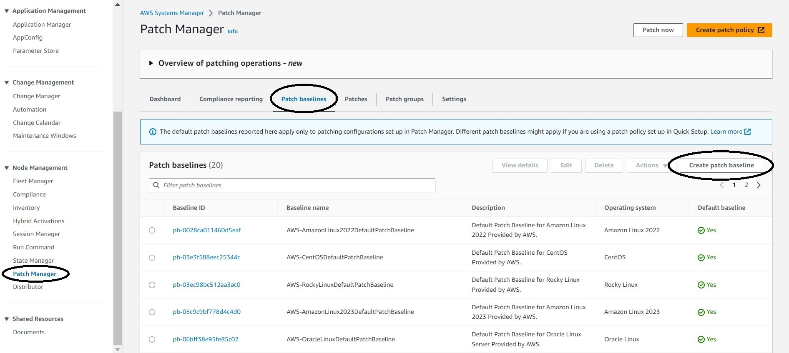]{header="Help: Screenshot"}

We will start with the critical severity patch baseline, so name it something similar to: SLES_Critical_Patches

Change the operating system to SUSE.

Ensure that the products and classification are set to all.

Select critical for severity, and make sure that that the days to approve the patches is set to 0.

For compliance reporting we will select critical, since any patches that this baseline catches will be critical.

Select the checkbox to make this our default patch baseline for all SUSE instances. This means that it will be used when patching all the SUSE instances in your fleet that are not associated with a patch group. Later in this lab we will be running a patch on demand operation against this default baseline.

Leave the rest at their defaults and click **Create patch baseline**.

::expand[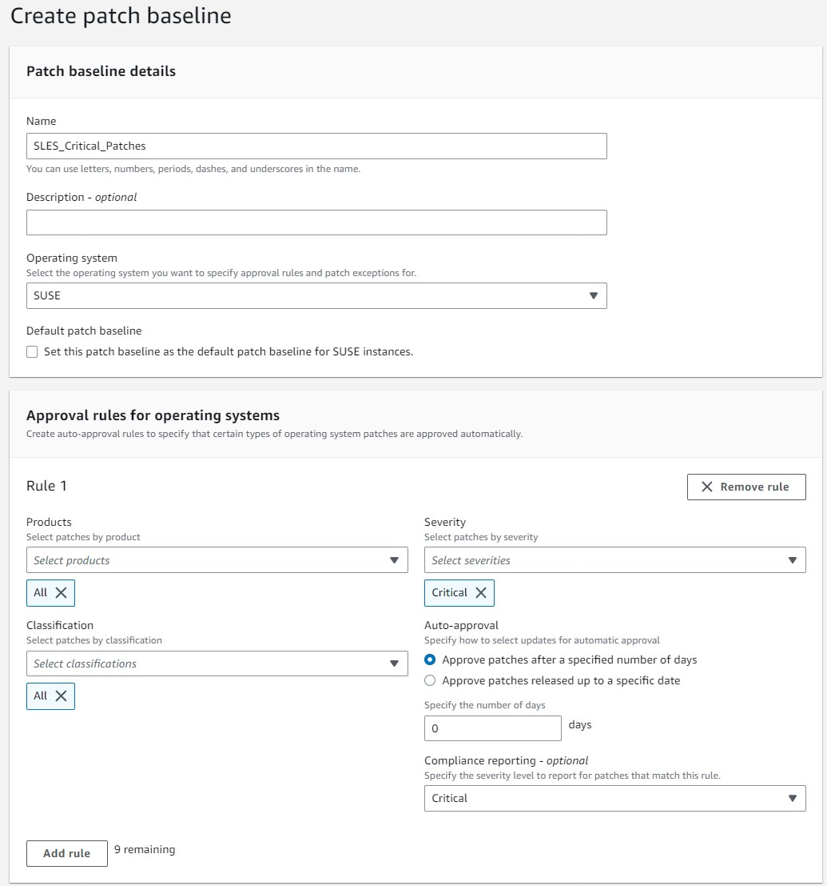]{header="Help: Screenshot"}

**Next repeat the steps above with following differences**

- Name it SLES_All_Patches
- For severity, select All

#### Step 4: Configure Patch Manager Policy

On the AWS Systems Manager page, click Patch Manager on the left-hand menu and then click "Create patch policy" in the top right corner.

::expand[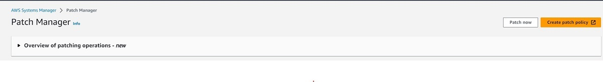]{header="Help: Screenshot"}

**Configuration name**

- Name it SLES-ScanandPatch_Critical

**Scan vs Scan and Install**

- We will go with Scan and Install, but this is up to you.
- We are starting with the Critical baseline, so click the button to reboot if needed.

**Patch Baseline**

- Select custom patch baseline
- For SUSE Linux Enterprise Server (SLES) select our recently created critical patches baseline

To conform with best practice, set up an S3 bucket in the S3 console, located in the same region to store logs into

- Select the bucket you created as the target for logs.

**Targets Section**

- Choose which instances you want this to apply to.

- We will pick the region with our SLES lab instance, and then select that instance.

**Rate control options**

- Leave all options at their default selections.

**Instance profile options**

- Click the checkbox to add the required IAM permissions.

Click **Create**.

**Next repeat the steps above with following differences**

- For patch baseline, select the all patches baseline you created.

::expand[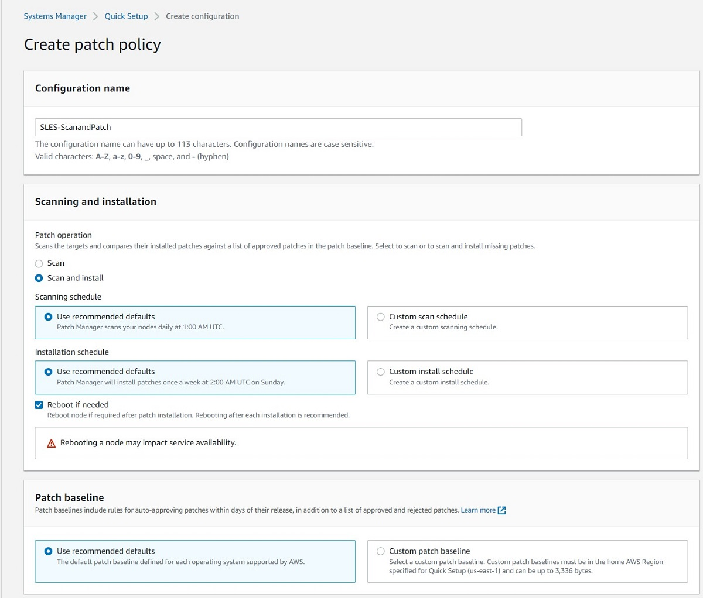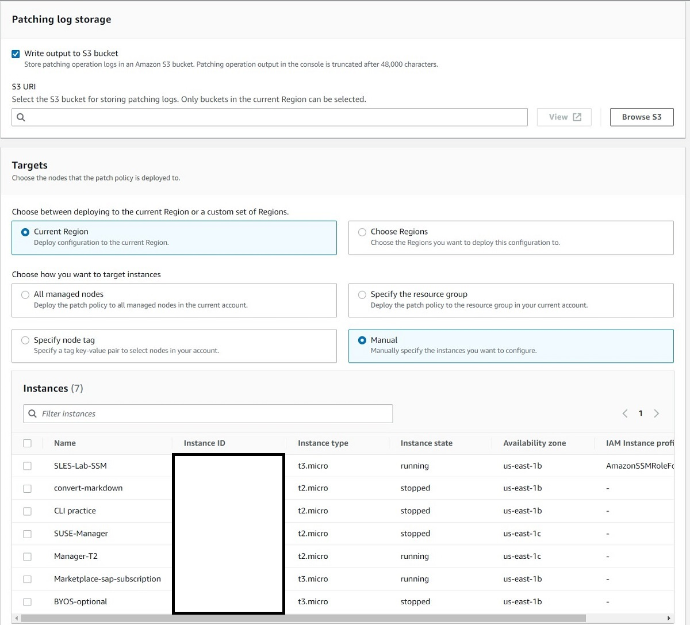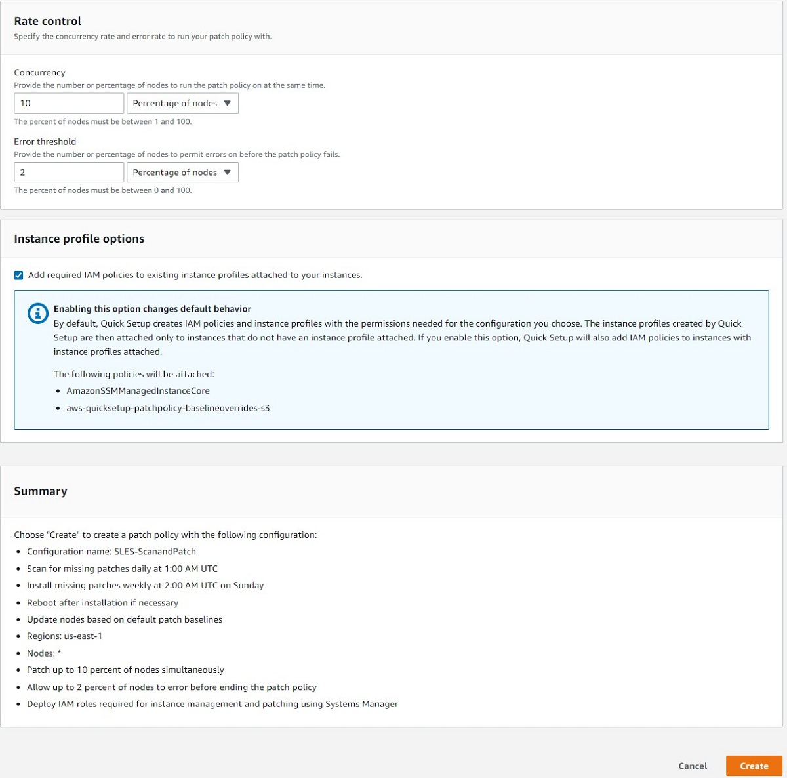]{header="Help: Screenshots"}

#### Step 5: Attach S3 Write Permissions to Lab Instance

The patch policy automatically attaches permissions to our instance that allow it to use the SSM agent to carry out patching procedures. However, in order for the instance to be able to successfully write logs to an S3 bucket, we have to add an additional policy to the Lab Instance's IAM role.

First, navigate to the [EC2 instance dashboard](https://us-east-1.console.aws.amazon.com/ec2/home?region=us-east-1#Instances:instanceState=running) and select your EC2 instance. Then under instance details, click on link to the instance's IAM role to add permissions to it.

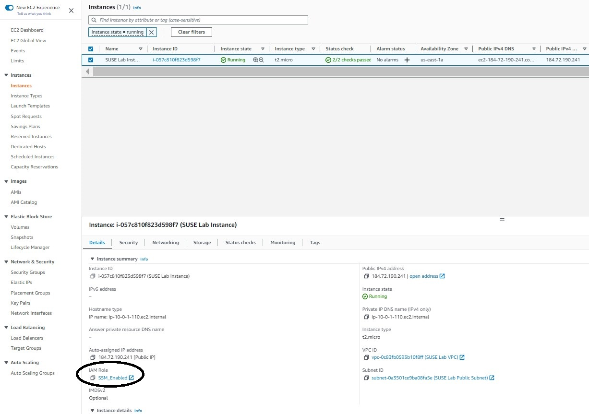

Once you are at the IAM role summary page, click the dropdown menu that says "Add permissions" and select "Create inline policy". 

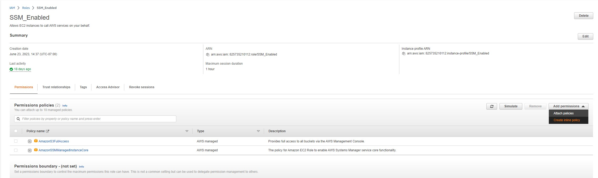

In the top right select JSON as the Policy editor, and then copy and paste the following policy into the provided box, replacing "EXAMPLE" with the name of your S3 bucket. This will allow the EC2 instance programmatic access to the bucket that you specify.

:::code{showLineNumbers=true}
{
  "Version": "2012-10-17",
  "Statement": [
    {
      "Effect": "Allow",
      "Action": ["s3:ListBucket"],
      "Resource": ["arn:aws:s3:::EXAMPLE"]
    },
    {
      "Effect": "Allow",
      "Action": [
        "s3:PutObject",
        "s3:GetObject",
        "s3:DeleteObject"
      ],
      "Resource": ["arn:aws:s3:::EXAMPLE/*"]
    }
  ]
}
:::

Click **Next** and on the next page name the policy "Log-Bucket-Programmatic-Access". Then click **Create policy**.
<!-- ::alert[In a long-term environment, it is best practice to create and attach a custom policy that only provides the EC2 instance with the permissions to write to a specific S3 bucket rather than full S3 access. If you wish to do this, you will need to create a policy from scratch, which you can do by following this [bucket-specific template](https://aws.amazon.com/blogs/security/writing-iam-policies-how-to-grant-access-to-an-amazon-s3-bucket/), and [this guide](https://docs.aws.amazon.com/IAM/latest/UserGuide/access_policies_create-console.html#access_policies_create-json-editor) on how to create the policy in the AWS console. You can then attach your new policy instead of AmazonS3FullAccess.] -->

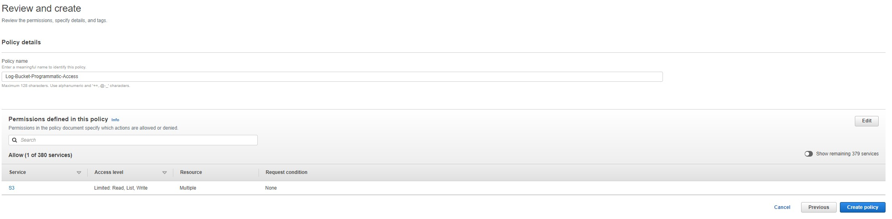

This will take you back to the role summary, and you should now see the log bucket programmatic access role under the attached permissions.

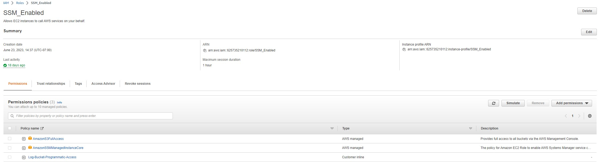

### Activity 2: On Demand Patching & Compliance Testing

#### Step 1: Patch Now

We can test our instance compliance on demand, by clicking "Patch now".

Select the following values:

- Patching operation: Scan and install
- Instances to patch: Patch only the target instances I specify
    - Choose instances manually
    - Select your SUSE Lab Instance
- Patching log storage: select the same S3 bucket that you used earlier in this lab

::alert[You will have to wait approximately 5 minutes while the IAM roles populate before the lab instance will appear as an option to patch on demand.]

Click **Patch now**.

It should run successfully, giving you a success screen as seen below.

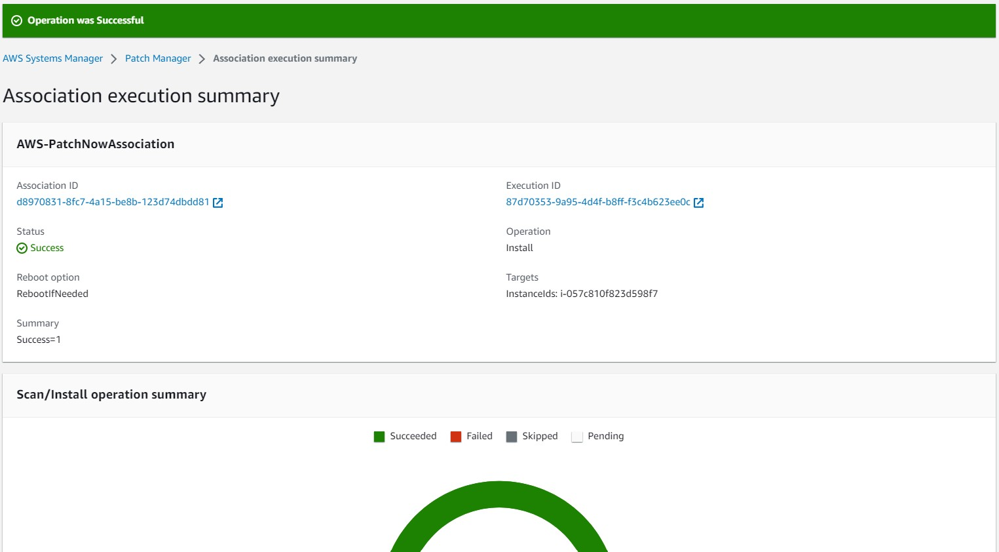

### Step 2: Check Compliance

Now that we have run a scan & install patching procedure, we can check our instances compliance by clicking on the compliance reporting on the patch manager main page. You can then select your lab instance from the Node patching details list, and scroll to the left to see compliance information such as noncompliance count, last operation date, etc.

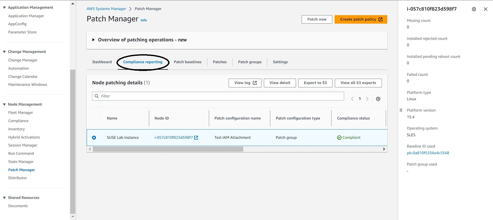

To view the logs from the last patching operation run on the instance, you can select "View Log" to inspect the logs of the commands and outputs that were on run on the instance by the SSM agent during the patching operation.

### Troubleshooting

- Make sure the instance has SSM agent enabled and running.

- Make sure that the instance has the necessary permissions (should have clicked to create them in the quick setup policy).

- Make sure the ssm agent is up to date.
    - Auto upgrade from console: https://docs.aws.amazon.com/systems-manager/latest/userguide/ssm-agent-automatic-updates.html

- **Patch now operation failed after starting?** Investigate the patching logs. You can do so by clicking on the compliance reporting on the [patch manager main page](https://us-east-1.console.aws.amazon.com/systems-manager/patch-manager/reporting?region=us-east-1). You can then select your lab instance from the Node patching details list, and click "View log". This will take you to the overview page where you can see a brief description of the error from the logs. This page will also have a link to the S3 bucket folder where the complete command output and complete error output are stored, so that you can isolate exactly what went wrong.
::expand[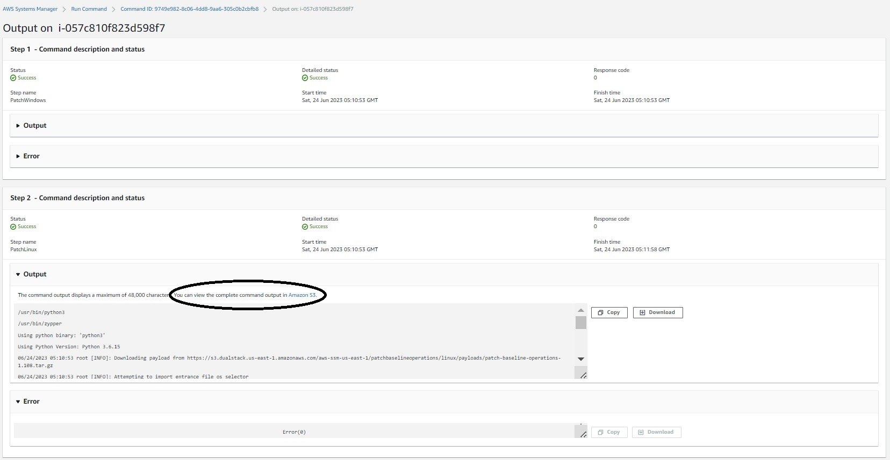**Click inside the folder to select either the complete command output or the error output**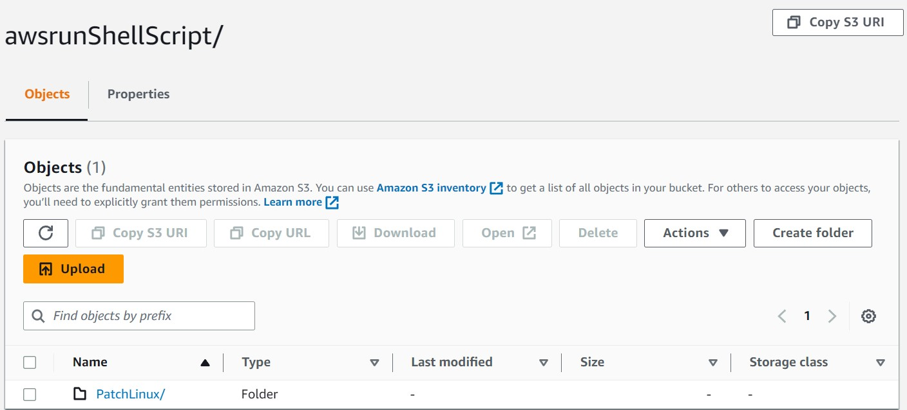]{header="Help: Screenshots"}

- **SLES for SAP Patch Update:** If you are running patches for a SLES for SAP instance, you may run into an error similar to the below.
:::code{showCopyAction=false showLineNumbers=true}
/nAborting installation due to the need for license confirmation.\\nPlease restart the operation in interactive mode and confirm your agreement with required licenses, or use the —auto-agree-with-licenses option.\\n"',))
:::
- **To Fix:**
    - Navigate to `/etc/zypp` and open `zypper.conf` in your favorite command line text editor (Vim works well with SLES instances).
    - Update the `autoAgreeWithLicenses` parameter as follows: `autoAgreeWithLicenses = yes`.
    - Save the file and exit.
    - The patch update process should now run successfully.

::alert[Remember, if you are using a personal account and are unable to complete the labs for any reason, please clean up/terminate any resources from the AWS console by following the instructions in [Lab 05. Cleanup](../../lab05-cleanup)]

**End of Lab**