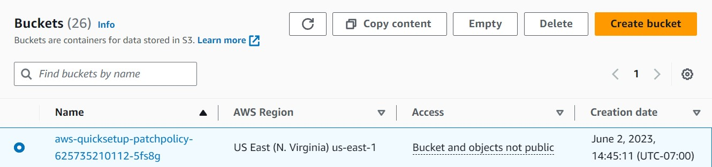
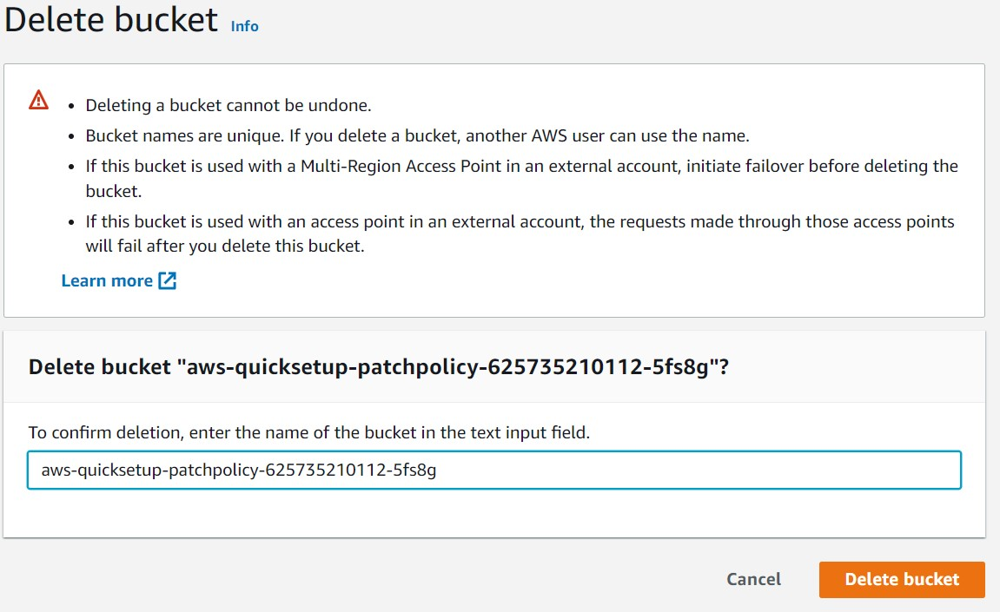
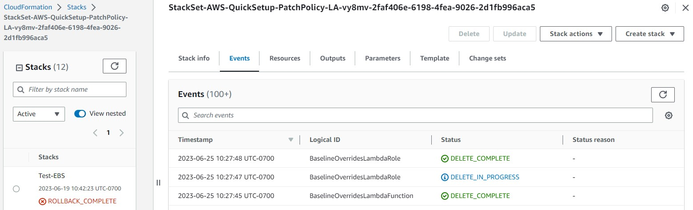
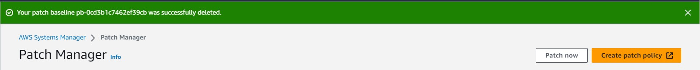

<!--
Copyright Amazon.com, Inc. or its affiliates. All Rights Reserved.
SPDX-License-Identifier: MIT-0
-->

### Activity 1: Cleanup

#### Step 1: Delete Security Group
If you manually provisioned your infrastructure, cleanup is straightforward and easy. Navigate to the [EC2 console](https://us-east-1.console.aws.amazon.com/ec2/home?region=us-east-1#Instances:instanceState=running), and select the instance that you launched and used throughout the labs. You will then go to the "Security" tab for the instance, and select the link to the security group that was created for the instance. Once there, go to the "Actions" dropdown in the top right, select "Delete security groups" and confirm.

#### Step 2: Delete Key Pair
Once again, navigate to the [EC2 console](https://us-east-1.console.aws.amazon.com/ec2/home?region=us-east-1#Instances:instanceState=running), and select the instance that you launched and used throughout the labs. Under the details tab, find the "Key pair assigned at launch" and click the linked key pair. From the list of key pairs, select the key pair that you used for the lab, go to the "Actions" dropdown in the top right, select "Delete" and confirm.

#### Step 3: Delete Lab Instance

For the last time, navigate to the [EC2 console](https://us-east-1.console.aws.amazon.com/ec2/home?region=us-east-1#Instances:instanceState=running), and select the instance that you launched and used throughout the labs. You will then go to the "Instance State" dropdown in the top right, and select "Terminate Instance". Once the instance has successfully terminated, you are good to go.

#### Step 4: Delete Patching Logs S3 Bucket

To delete the S3 bucket that you used to store patching logs, navigate to [S3](https://s3.console.aws.amazon.com/s3/home?region=us-east-1) in the AWS console. From the list of buckets, find the one you created for storing patching logs and select it. 

Before we can delete the bucket, we first need to empty it, so click the "Empty" button from the top menu and confirm by typing "permanently delete".

Once it has been successfully emptied, select the bucket again from the list of buckets and this time choose the "Delete" button from the top menu and confirm by typing the name of the bucket.

#### Step 5: Delete Patch Manager Patch Policy

Next, we will delete the patch policy that we set up in patch manager. To do so, we will navigate to the [CloudFormation Dashboard](https://us-east-1.console.aws.amazon.com/cloudformation/home?region=us-east-1#/stacks?filteringText=&filteringStatus=active&viewNested=true), and then select "Stacks" from the left-hand menu. You will then select the stack that Patch Manager automatically created when you set up your patch policy. It should be named something similar to "StackSet-AWS-QuickSetup-PatchPolicy-...". Choose "Delete" from the menu in the top right, and then confirm that you want to delete the stack when it asks you to. This will automatically roll back all resources that were created for the lab, with the CloudFormation template.

#### Step 6: Delete Patch Manager Patch Baseline

Navigate to the [Patch Manager](https://us-east-1.console.aws.amazon.com/systems-manager/patch-manager?region=us-east-1) feature of AWS Systems manager. Once there, select "Patch baselines" from the middle menu.

Once there, select the patch baseline(s) that you created. Then to remove the patch baseline, simply choose Delete and confirm when the system prompts you to.

::alert[If they are the default, you will need to select a new patch baseline and make the default first. To do this, you can search for the "AWS-SuseDefaultPatchBaseline", select it, and then make it the default patch baseline by clicking on "Set default patch baseline" in the Actions dropdown menu.]

