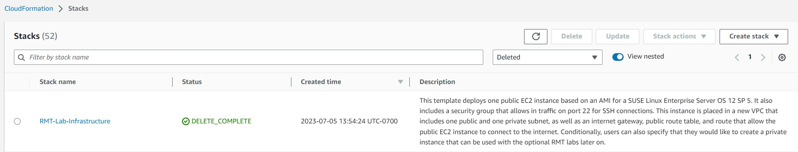

<!--
Copyright Amazon.com, Inc. or its affiliates. All Rights Reserved.
SPDX-License-Identifier: MIT-0
-->

Because we provisioned the infrastructure through the service catalog option, cleanup will be clean and simple. Navigate to the AWS Service Catalog in the console, and then select "Provisioned products" from the left-hand menu. You will then select the product that you created, and select "Terminate" from the "Actions" dropdown in the top right corner. This will automatically roll back all resources that were created for the lab, and you are good to go!

