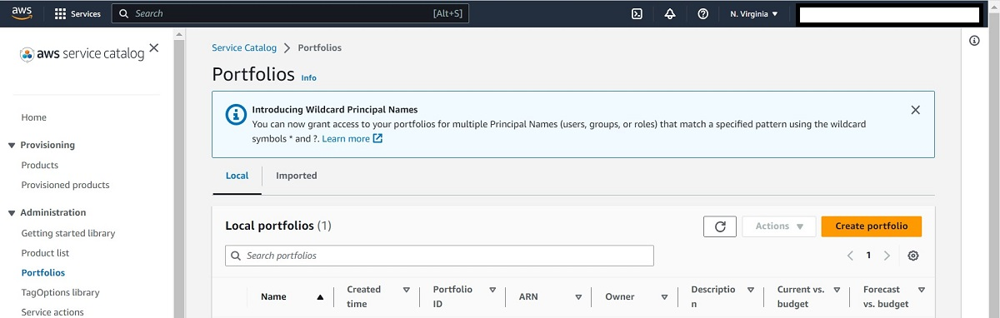
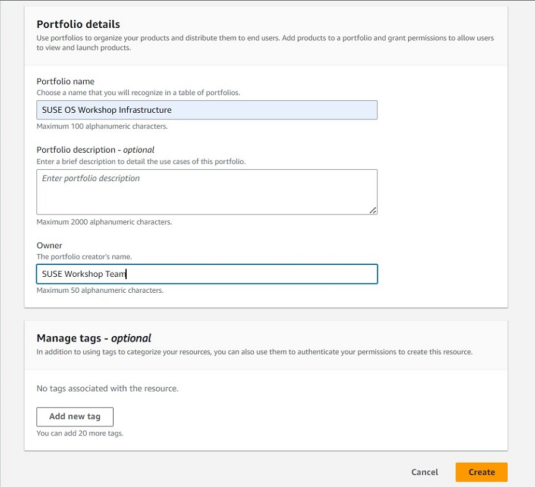
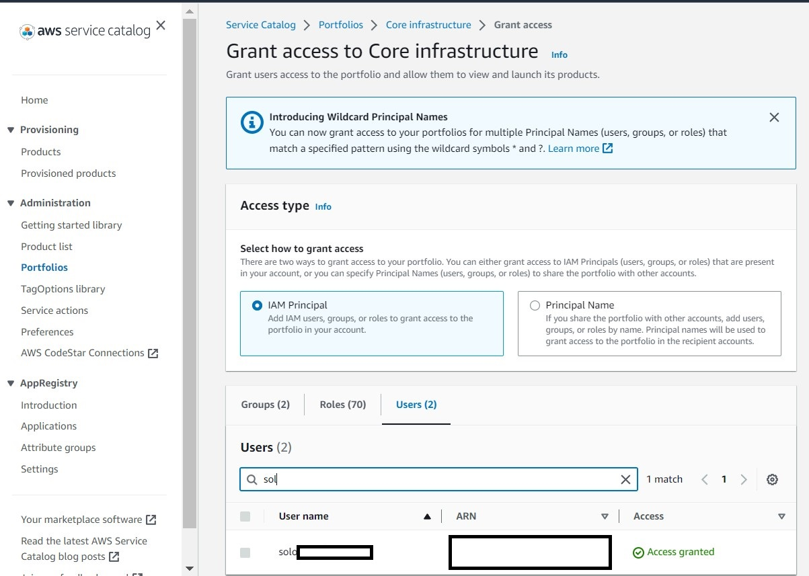
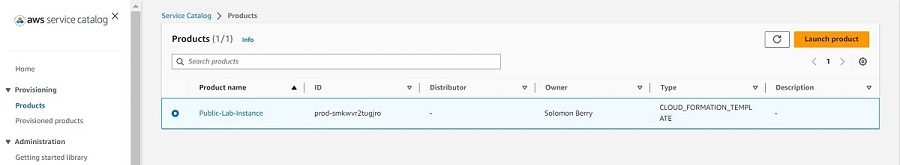

<!--
Copyright Amazon.com, Inc. or its affiliates. All Rights Reserved.
SPDX-License-Identifier: MIT-0
-->

This lab is completely optional, and requires a preexisting subscription with SUSE to operate. If you want to use PAYG (and not BYOS) instances through AWS, do not have an existing subscription with SUSE, or do not need to keep your instances isolated from the public internet, you should not continue with this lab. 

However, if you wish to practice setting up a private repository for our SLES instance to connect to, we will first need to provision the necessary architecture. This will require a public instance in a public subnet, a private instance in a private subnet that resides in the same VPC as the public subnet, and a properly configured security group among other things. To accomplish this setup, we will be configuring and then launching a service catalog product.

### Prerequisites Checklist
- AWS Infrastructure Requirements
    - VPC
    - Public Subnet
    - Private Subnet
    - Internet Gateway
    - Routing Table
    - Security Group
    - Key Pair
    - Public Instance
    - Private Instance 
- Workstation to access the environment, including a browser and Terminal session.
- SUSE Product Credentials - SUSE SLES (for SAP) registration key from the SUSE Customer Center (60 Day)

-----

::alert[Please ensure that you subscribe to the **SUSE Linux Enterprise Server 12 Family BYOS** AWS Marketplace Listing, Figure 1 and 2, before you Launch the CloudFormation template]

Step 1: Open a Browser and Navigate to the AWS Marketplace Listing for [SUSE Linux Enterprise Server 12 Family BYOS](https://aws.amazon.com/marketplace/pp/prodview-cx42luwzj5s6s).
If you are not already Select enrolled, select **Continue to Subscribe**.

_Figure 1: SUSE Linux Enterprise Server 12 Family BYOS, AWS Marketplace Listing, Step 1, Select **Continue to Subscribe**_

Step 2: Select **Accept Terms** and wait a few minutes until the Enrollment is processed.

_Figure 2: SUSE Linux Enterprise Server 12 Family BYOS, AWS Marketplace Listing, Step 2, Select **Accept Terms**_

-----

#### Architecture Diagram

*Figure 3: Architecture Diagram, a new VPC with a Internet Gateway, Routing Table, one Public and Private Subnet that share a Security Group, two EC2 Instances with SLES 12.5 BYOS.*

### Activity 1: Create a Service Catalog Portfolio

**💡 TIP**\
If you have already created a portfolio in the setup for the main labs, you can skip to [Activity #2](#activity-2:-create-and-launch-our-infrastructure-as-a-product)

#### Step 1: Navigate to the Service Catalog

First start in the AWS console, and make sure that you are in the North Virginia region, as our template is setup to work in that region specifically. You can find what region you are by checking the top right corner of the console, and if needed you can select that region and pick a new one from the dropdown menu. After selecting the correct region, search for and select 'Service Catalog' from the top search bar. 

#### Step 2: Create the Portfolio

We will now create a Portfolio in Service Catalog. In the left menu, click on Portfolios under Administration. Then click on Create portfolio.

For the Create portfolio settings, fill in the following values, and then click on Create.

- Portfolio name: SUSE OS Workshop Infrastructure Templates

- Owner: Linux Team

### Activity 2: Create and Launch our Infrastructure as a Product

We can now see our newly created portfolio under Local portfolios. Click on the link on the name, to move to the Portfolio details.

You should now be able to see the portfolio under Local portfolios. Move to our portfolio details by clicking on the portfolio name.

#### Step 1: Create our Infrastructure Product

You should now see the details panel for the portfolio that we just created. The next step is to add our product into the portfolio so that we can use it to provision the resources needed for the workshop.

Next, let's add a Product for creating our lab infrastructure by clicking "Create Product"

- Under Product details, set the Product type to CloudFormation.

- Under the Product details section fill in the below values and leave the rest of the values to their defaults.

    - Product name: RMT Lab Setup
    - Owner: Linux Team

- Under the Version details section, select Use a template file. Then download the file from this link :link[Cloud Formation Template]{href="/static/rmt/RMT_Infra.yaml" action=download}. Back on the AWS console, click the Choose file option, and select the template that you just downloaded. 

- Once you have uploaded the file and made sure that the settings are correct, click on Create product at the bottom of the page.

#### Step 2: Grant Access to the Product

Once you are back to the infrastructure Portfolio details page, you should be able to see the newly created product. If not, try clicking on the refresh button. However, before we are able to actually use the product, we will need to grant access to it. To do so, click on the Access tab and then click the Grant access button.

On the Grant access page, leave the Access type as is, and click on the Roles or Users tab (depending on how you are accessing this AWS account), and then search for your specific role or user. Next check the box next to your User or Role, and click on the Grant access button.

**💡 TIP**\
If you are having trouble determining which user to give access to and are using an Isengard account, you most likely need to grant access to the "Admin" role. 

#### Step 3: Launch the Product

Now that we've added access, let's see the Products we've added. In the left panel, click on Products, under the Provisioning group. You should see our Products that we created, listed here. It is now ready for use to provision more resources by clicking on it, and selecting Launch Product.

In the launch settings, name your product.

In the parameters section:

1. Fill in the name of the keypair that you wish to use. If you do not already have a key pair, you will need to create one through the AWS console. 

- Make sure that you just put the name, and not the file extension. For example, it would be keypair, not keypair.pem
- If you need to create and download your own keypair, you can follow this guide: [How to Create a key pair in the AWS Console](https://docs.aws.amazon.com/AWSEC2/latest/UserGuide/create-key-pairs.html#having-ec2-create-your-key-pair)

Then click Launch Product

Your infrastructure should now successfully create!

### Activity 3: Prepare the EBS disk via the SLES Operating System

#### Step 1: Check the OS has detected the volume 

Start a terminal session to the RMT instance. 

Confirm the EBS volume appears to the OS by running the following command:

:::code{showCopyAction=true showLineNumbers=true}
    lsblk
:::

The output should appear similar to the below. It should be possible to see the 30GB disk in the 

output. 

:::code{showCopyAction=false showLineNumbers=true}
    ec2-user@ip-172-31-18-31:~> lsblk
    NAME MAJ:MIN RM SIZE RO TYPE MOUNTPOINT
    xvda 202:0 0 10G 0 disk
    └─xvda1 202:1 0 10G 0 part /
    xvdf 202:80 0 30G 0 disk
    ec2-user@ip-172-31-18-31:~>
:::

**💡 TIP**\ It is fine if your disk is not named exactly xvdf, just use the name it shows when running the commands in the next step.

#### Step 2: Partition the disk and create a filesystem 

Create a partition table with parted (replace xvdf with whatever your disk was named when you ran lsblk)

:::code{showCopyAction=true showLineNumbers=true}
    sudo parted /dev/xvdf mklabel gpt
:::

Create a Primary XFS partition

:::code{showCopyAction=true showLineNumbers=true}
    sudo parted -a optimal /dev/xvdf mkpart primary xfs 0% 100%
:::

The output should be as follows

:::code{showCopyAction=true showLineNumbers=true}
    ec2-user@ip-172-31-18-31:~> sudo parted -a optimal /dev/xvdf mkpart primary xfs 0% 100%
    Information: You may need to update /etc/fstab.
:::

Create the XFS filesystem with the following command: 

:::code{showCopyAction=true showLineNumbers=true}
    sudo mkfs.xfs /dev/xvdf1 -L RMTDATA
:::

:::code{showCopyAction=true showLineNumbers=true}
    ec2-user@ip-172-31-18-31:~> sudo mkfs.xfs /dev/xvdf1
    meta-data=/dev/xvdf1 isize=512 agcount=4, agsize=1965952 blks
    = sectsz=512 attr=2, projid32bit=1
    = crc=1 finobt=1, sparse=0, rmapbt=0
    = reflink=0
    data = bsize=4096 blocks=7863808, imaxpct=25
    = sunit=0 swidth=0 blks
    naming =version 2 bsize=4096 ascii-ci=0, ftype=1
    log =internal log bsize=4096 blocks=3839, version=2
    = sectsz=512 sunit=0 blks, lazy-count=1
    realtime =none extsz=4096 blocks=0, rtextents=0
    ec2-user@ip-172-31-18-31:~>
:::

#### Step 3: Mount the New Disk

Create a mount point for the new disk

:::code{showCopyAction=true showLineNumbers=true}
    mkdir /var/lib/rmt
:::

Next, add the following to /etc/fstab to ensure the new filesystem is mounted at boot time

:::code{showCopyAction=true showLineNumbers=true}
    echo 'LABEL=RMTDATA /var/lib/rmt xfs defaults 0 0' | sudo tee -a /etc/fstab
:::

Mount the new filesystem 

:::code{showCopyAction=true showLineNumbers=true}
    sudo mount -a
:::

Check the filesystem is mounted 

:::code{showCopyAction=true showLineNumbers=true}
    mount | grep xfs
:::

Note that /dev/xvdf1 is now mounted on /srv 

:::code{showCopyAction=true showLineNumbers=true}
    ec2-user@ip-172-31-18-31:~> mount | grep xfs
    /dev/xvda1 on / type xfs (rw,relatime,attr2,inode64,logbufs=8,logbsize=32k,noquota)
    /dev/xvdf1 on /var/lib/rmt type xfs
    (rw,relatime,attr2,inode64,logbufs=8,logbsize=32k,noquota)
    ec2-user@ip-172-31-18-31:~>
:::

**Move on to Task 02**