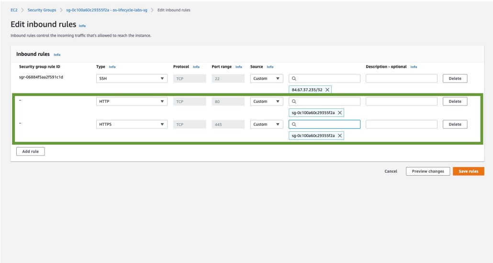
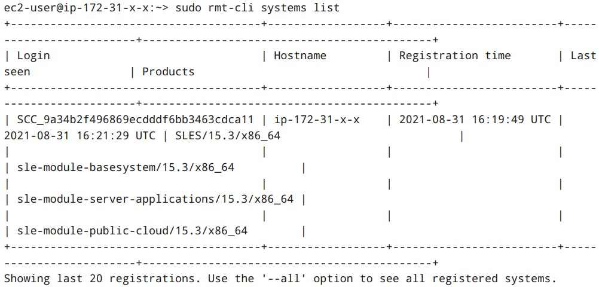

<!--
Copyright Amazon.com, Inc. or its affiliates. All Rights Reserved.
SPDX-License-Identifier: MIT-0
-->

### Activity 4: Ensure Communication is possible between the RMT instance and the private lab server 

#### Step 1: Reconfigure the Lab Security Group

In order for the two instances to communicate over the network, additional rules need to be added to the security group.

From the EC2 Console, select **Security Groups** then **Inbound rules** then select **Edit inbound 

rules**



Add two rules, one for HTTP one for HTTPS which allow traffic from the security group itself. 

Select **Save Rules** 

#### Step 2: Upload the Keypair file to the RMT Server

Because the SLES instance is in a private subnet, it cannot be accessed across the public internet. Because of this, we will be connecting to our private instance from our RMT server. Because they are in the same VPC, and the security group rules allow traffic between instances in the same security group, we can connect from the RMT server to the private SLES instance. However, to do this we will need to upload the keypair file to the RMT server.

To do this, run the below command. You will need to replace the first file path with the local path to your keypair file, the second file path again with the local path to your keypair file, and the x'd out IP address with the public IP address of your RMT server.

:::code{showCopyAction=true showLineNumbers=true} 
scp -i /directory/to/abc.pem /your/local/file/to/copy ec2-user@xx-xx-xxx-xxx:~/
:::

After uploading the file, SSH on to the public RMT server, and check that the file was successfully uploaded by running:

:::code{showCopyAction=true showLineNumbers=true} 
ls
:::

:::code{showCopyAction=false showLineNumbers=true}
ec2-user@ip-172-31-89-152:~> ls

your_keypair.pem  bin
:::

#### Step 3: Connect to the Private Instance

Once you see that the file was successfully uploaded, run the following command to give the keypair file the proper permissions:

:::code{showCopyAction=true showLineNumbers=true} 
chmod 400 keypair.pem
:::

Then from your RMT server you can SSH into the private SLES instance using the keypair file and the private instance's private IP address:

:::code{showCopyAction=true showLineNumbers=true} 
ssh -i your_keypair.pem ec2-user@private-instance-IP
:::

::alert[You can find the private IP address in the [EC2 Instance dashboard](https://us-east-1.console.aws.amazon.com/ec2/home?region=us-east-1#Instances:instanceState=running) by selecting your private instance and looking under details.]

### Activity 5: Register the private lab instance with the RMT Server 

#### Step 1: Disconnect instance from the SUSE Customer Center

Start (or resume) an SSH session to the RMT server. 

Because the RMT instance was just created in the first part of this lab through the service catalog, it shouldn't be connected to the SCC. However, check to make sure with the following command:

:::code{showCopyAction=true showLineNumbers=true} 
sudo SUSEConnect --status-text
:::

It should say that the instance is currently unregistered. However, if it IS currently registered, run the below:

:::code{showCopyAction=true showLineNumbers=true} 
SUSEConnect -d
:::

```
ec2-user@ip-172-31-18-31:~> SUSEConnect -d
Root privileges are required to register products and change software repositories
ec2-user@ip-172-31-18-31:~> sudo SUSEConnect -d
Deregistering system from SUSE Customer Center
Deactivating sle-module-python2 15.3 x86_64 ...
-> Removing service from system ...
-> Removing release package ...
Deactivating sle-module-public-cloud 15.3 x86_64 ...
-> Removing service from system ...
-> Removing release package ...
Deactivating sle-module-legacy 15.3 x86_64 ...
-> Removing service from system ...
-> Removing release package ...
Deactivating sle-module-web-scripting 15.3 x86_64 ...
-> Removing service from system ...
-> Removing release package ...
Deactivating sle-module-server-applications 15.3 x86_64 ...
-> Removing service from system ...
-> Removing release package ...
Deactivating sle-module-development-tools 15.3 x86_64 ...
-> Removing service from system ...
-> Removing release package ...
Deactivating sle-module-desktop-applications 15.3 x86_64 ...
-> Removing service from system ...
-> Removing release package ...
Deactivating sle-module-basesystem 15.3 x86_64 ...
-> Removing service from system ...
-> Removing release package ...
-> Removing service from system ...
Cleaning up ...
Successfully deregistered system
```

You can confirm that the instance is not connected to the SCC by seeing which repositories are active.

:::code{showCopyAction=true showLineNumbers=true} 
zypper lr
:::

The output should state that no repositories are defined

:::code{showCopyAction=false showLineNumbers=true}
ec2-user@ip-172-31-18-31:~> zypper lr
Warning: No repositories defined.
Use the 'zypper addrepo' command to add one or more repositories.
ec2-user@ip-172-31-18-31:~>
:::

#### Step 2: Connect Instance to the Private Repository

Run the following command to register your new instance against your private RMT Server. Remember to put in the actual IP of your RMT server! 

:::code{showCopyAction=true showLineNumbers=true} 
sudo SUSEConnect --url http://LOCAL_IP_ADDRESS_OF_YOUR_RMT-SERVER
:::

The output should look similar to the below 

:::code{showCopyAction=false showLineNumbers=true} 
ec2-user@ip-172-31-24-135:~> sudo SUSEConnect --url http://172.31.x.x
Registering system to registration proxy http://172.31.x.x
Announcing system to http://172.31.x.x ...
Activating SLES 15.3 x86_64 ...
-> Adding service to system ...
Activating sle-module-basesystem 15.3 x86_64 ...
-> Adding service to system ...
-> Installing release package ...
Activating sle-module-server-applications 15.3 x86_64 ...
-> Adding service to system ...
-> Installing release package ...
Successfully registered system
:::

#### Step 3: Activate Additional Modules

Activate the Public Cloud module with 

:::code{showCopyAction=true showLineNumbers=true} 
sudo SUSEConnect -p sle-module-public-cloud/15.3/x86_64
:::

List other modules to activate

:::code{showCopyAction=true showLineNumbers=true} 
sudo SUSEConnect --list-extensions
:::

Note that in the output, many of the modules are marked as (Not available). This is because they have not been mirrored to your Private Repo from the SUSE Customer Center. 

:::code{showCopyAction=false showLineNumbers=true} 
AVAILABLE EXTENSIONS AND MODULES
Basesystem Module 15 SP3 x86_64 (Activated)
Deactivate with: SUSEConnect -d -p sle-module-basesystem/15.3/x86_64
Containers Module 15 SP3 x86_64 (Not available)
Activate with: SUSEConnect -p sle-module-containers/15.3/x86_64
Desktop Applications Module 15 SP3 x86_64 (Not available)
Activate with: SUSEConnect -p sle-module-desktop-applications/15.3/x86_64
Development Tools Module 15 SP3 x86_64 (Not available)
Activate with: SUSEConnect -p sle-module-development-tools/15.3/x86_64
NVIDIA Compute Module 15 x86_64 (Not available)
Activate with: SUSEConnect -p sle-module-NVIDIA-compute/15/x86_64
SUSE Linux Enterprise Workstation Extension 15 SP3 x86_64 (Not available)
Activate with: SUSEConnect -p sle-we/15.3/x86_64
Python 2 Module 15 SP3 x86_64 (Not available)
Activate with: SUSEConnect -p sle-module-python2/15.3/x86_64
SUSE Cloud Application Platform Tools Module 15 SP3 x86_64 (Not available)
Activate with: SUSEConnect -p sle-module-cap-tools/15.3/x86_64
SUSE Package Hub 15 SP3 x86_64 (Not available)
Activate with: SUSEConnect -p PackageHub/15.3/x86_64
Server Applications Module 15 SP3 x86_64 (Activated)
Deactivate with: SUSEConnect -d -p sle-module-server-applications/15.3/x86_64
Legacy Module 15 SP3 x86_64 (Not available)
Activate with: SUSEConnect -p sle-module-legacy/15.3/x86_64
Public Cloud Module 15 SP3 x86_64
Activate with: SUSEConnect -p sle-module-public-cloud/15.3/x86_64
SUSE Linux Enterprise High Availability Extension 15 SP3 x86_64 (Not
available)
Activate with: SUSEConnect -p sle-ha/15.3/x86_64
Web and Scripting Module 15 SP3 x86_64 (Not available)
Activate with: SUSEConnect -p sle-module-web-scripting/15.3/x86_64
Transactional Server Module 15 SP3 x86_64 (Not available)
Activate with: SUSEConnect -p sle-module-transactional-server/15.3/x86_64
(Not available) The module/extension is not enabled on your RMT/SMT
(Activated) The module/extension is activated on your system
MORE INFORMATION
You can find more information about available modules here:
https://www.suse.com/documentation/sles-15/singlehtml/art_modules/art_modules.html
::: 

### How to: 5b: Detach running PAYG instance from PCUI and connect to the RMT Server (Optional)

Whilst **not needed for this lab**, PAYG instances of SLES or SLES for SAP must first be detached from the Public Cloud Update Infrastructure before connecting to the Private Repository. To prepare instances to connect to a private repository, you need to remove packages that automate the configuration of the Amazon EC2 instance to connect to the SUSE Public Cloud Update Server. To do so, SSH onto your lab instance and run the following commands.

1. zypper rm cloud-regionsrv-client 
2. zypper rm regionServiceClientConfigEC2 
3. Remove the /etc/hosts entry for smt-ec2.susecloud.net. The client automation software adds the host file entry for smt-ec2.susecloud.net which is the SUSE Public Cloud Update Server. Since a private repository server is being created, the entry will not be needed. 
4. Remove the following directories before you register your Amazon EC2 instance to your private repository server. 
5. rm /etc/SUSEConnect 
6. rm /etc/zypp/credentials.d/* 
7. rm /etc/zypp/services.d/* 
8. rm /var/lib/cloudregister/*

### Activity 6: View Managed Instances on the RMT Server

#### Step 1: Use rmt-cli to show managed systems

It is possible to list instances managed by the RMT Server and which channels the instances have 

activated

Launch (or return to) the SSH Session to the instance running RMT. Use the command below to do 

this

:::code{showCopyAction=true showLineNumbers=true} 
sudo rmt-cli systems list
:::

The output should look similar to the below



### Activity 7: Apply updates to your system  

This activity is run from the private lab instance

#### Step 1: Connect an SSH Session to the Lab Instance 

Connect (or reconnect) an SSH Session to the private lab server 

#### Step 2: Apply Updates from your RMT Server 

Apply updates to the system with zypper. For the purposes of the lab, we will execute a dry-run, which will not actually apply updates to the server

:::code{showCopyAction=true showLineNumbers=true} 
sudo zypper up -D
:::

**End of Lab**