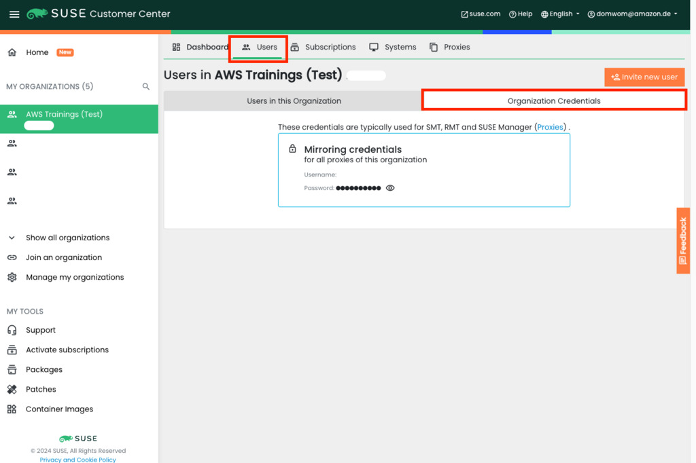
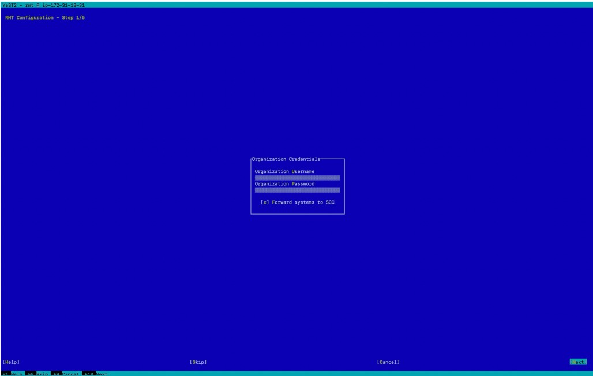

<!--
Copyright Amazon.com, Inc. or its affiliates. All Rights Reserved.
SPDX-License-Identifier: MIT-0
-->

It is sometimes necessary to deploy a 'Private Repository' Server in AWS to support SLES
instances, this is usually for security management reasons. Perhaps the instances that need
patching have no outbound connectivity (either via an internet gateway in AWS or via AWS Direct
Connect/local datacenter) and cannot reach SUSE Public Cloud Update Infrastructure. In this case, the customer will need to build one.

In this lab, we will connect to our public SLES instance and reconfigure it to be a Private Repository using [RMT](https://documentation.suse.com/sles/15-SP3/single-html/SLES-rmt/index.html). We will then connect to our private server, and configure it to connect to the RMT instance for updates and patches.

### Activity 0: Before you Begin

#### Step 1: Obtain your SUSE Organization Credentials

In order to deploy RMT, your SUSE Organization Credentials are needed. These can be found the
[SUSE Customer Center (SCC)](https://scc.suse.com).

Login to the SCC, choose your account which contains the subscription used for this workshop,
select users and Organizational Credentials

#### Step 2: Connect to the RMT Instance Through SSH

You should now connect to the RMT instance that was launched from our service catalog product. Get the public IP address of the instance from the AWS Console in the EC2 dashboard, and then connect to the instance via public IP address using the terminal of your choice (ssh, PuTTY etc.)

::expand[If you are having trouble finding the right command to ssh into your instance with, go to the EC2 dashboard, click on instances, then click on your instance, and hit the connect button at the top right. This will take you to a screen with different ways to connect to your instance. Select "SSH Client" and copy the example command. Then in your terminal, navigate to the folder where you've saved your keypair file, paste in the example command, and you should be able to connect.]{header="💡 TIP to Connect"}

#### Step 3: Connect the RMT Instance to the SUSE Customer Center (SCC)

To allow the RMT instance to act as a private repository, it will need access to the repositories from SUSE through the SUSE Customer Center (SCC). This lab uses a BYOS (Bring your own subscription) instance type from SUSE, so it needs to be manually connected to the SCC in order to provide access to updates and additional packages. Using the SLES Subscription Key, register the instance against the SCC using the following
command:

:::code{showCopyAction=true showLineNumbers=true} 
sudo SUSEConnect -r your-registration-code -u https://scc.suse.com
:::

The output should look similar to this:

:::code{showCopyAction=false showLineNumbers=true} 
ec2-user@ip-172-31-18-31:~> sudo SUSEConnect -r xxxx-xxxx-xxxxxxxxxx
Registering system to SUSE Customer Center
Announcing system to https://scc.suse.com ...
Activating SLES 12.5 x86_64 ...
Adding service to system ...
Successfully registered system
ec2-user@ip-172-31-18-31:~>
:::

### Activity 1: Install RMT

#### Step 1: Install RMT Packages

To install the RMT packages on the SLES instance run: 

:::code{showCopyAction=true showLineNumbers=true} 
sudo zypper in rmt-server
:::

This will install approximately 19 packages. Assuming no errors were encountered, proceed to 

the next step. 

### Activity 2: Configure RMT

#### Step 1: Use YaST to Configure RMT 

In order to configure RMT, the [YaST](https://yast.opensuse.org/) tool is used. This is an interactive interface. There are 5 

steps:

1. Start YaST with the rmt module 

2. Enter your organization's credentials from SCC. 

3. Enter the credentials for a new MariaDB user and database name. This user will then be 

created. 

4. (If no password is set for root, you are asked to set a new one) 

5. Enter a common name for the SSL certificates. 

Start the configuration process by running:

:::code{showCopyAction=true showLineNumbers=true} 
sudo yast rmt
:::

Enter your organization credentials. These can be found in the SUSE Customer Center (SCC) 

**💡 TIP**\ If you are having trouble selecting the box to type in your credentials, use the tab key to navigate

Select **Next** 

Set a database password, leave the user as 'rmt'. 

It may be necessary to set a root password for the db, if prompted, enter a password and select 

**OK** 

On the SSL Certificate screen (Step 3/5) Select **Next** 

YaST will prompt to set the 'CA Private Key Password' 

Enter and re-enter your chosen password. 

On the firewall screen (Step 4/5) there will be a message saying that firewalld is disabled. 

Select **Next** 

RMT will start, if successful the following screen is shown. 

Select **Next** 

Select **Finish** on the summary windows to return to the command prompt. 

#### Step 2: View the RMT Configuration

If you wish, view your configuration:

:::code{showCopyAction=true showLineNumbers=true} 
sudo cat /etc/rmt.conf
:::

### Activity 3: Sync Channels 

#### Step 1: Sync Data from RMT and List Available Channels 

The next step is to configure the server ready to mirror a set of patches from the SCC to the RMT Server.

:::code{showCopyAction=true showLineNumbers=true} 
sudo rmt-cli sync
:::

This could take up to 5 minutes. The output should be as follows:

:::code{showLineNumbers=true}
ec2-user@ip-172-31-18-31:~> sudo rmt-cli sync
I, [2021-08-31T14:01:24.612157 #16268] INFO -- : Downloading data from SCC
I, [2021-08-31T14:01:24.612310 #16268] INFO -- : Updating products
I, [2021-08-31T14:02:12.151419 #16268] INFO -- : Updating repositories
I, [2021-08-31T14:02:16.843380 #16268] INFO -- : Updating subscriptions
ec2-user@ip-172-31-18-31:~>
:::

After the initial sync is complete, it is possible to view the products that can be mirrored by RMT.

In the event of an HTTP 500 type error, try re-running the sync:

:::code{showCopyAction=true showLineNumbers=true} 
sudo rmt-cli products list --all
:::

The output will be a table showing products which can be mirrored.

For this lab, the SLES 15 SP3 product, and Public Cloud channels should be synchronized. 

#### Step 2: Enable the Desired Channels 

To enable a channel. Use the below command:

:::code{showCopyAction=false showLineNumbers=true}
rmt-cli products enable ID/name
:::

**💡 TIP**\
Verify the IDs from the output before running the rmt-cli command

For example, to enable the SLES 15 SP3 product use the following command

:::code{showCopyAction=true showLineNumbers=true} 
sudo rmt-cli products enable 2140
:::

The output is as follows. 

:::code{showCopyAction=true showLineNumbers=true} 
ec2-user@ip-172-31-18-31:~> sudo rmt-cli products enable 2140
Found product by target 2140: SUSE Linux Enterprise Server 15 SP3 x86_64.
Enabling SUSE Linux Enterprise Server 15 SP3 x86_64:
SUSE Linux Enterprise Server 15 SP3 x86_64:
Enabled repository SLE-Product-SLES15-SP3-Pool.
Enabled repository SLE-Product-SLES15-SP3-Updates.
Enabled repository SLE15-SP3-Installer-Updates.
Basesystem Module 15 SP3 x86_64:
Enabled repository SLE-Module-Basesystem15-SP3-Pool.
Enabled repository SLE-Module-Basesystem15-SP3-Updates.
Server Applications Module 15 SP3 x86_64:
Enabled repository SLE-Module-Server-Applications15-SP3-Pool.
Enabled repository SLE-Module-Server-Applications15-SP3-Updates.
:::

Enable the Public Cloud Repository for SLES 15 SP3

:::code{showCopyAction=true showLineNumbers=true} 
sudo rmt-cli products enable 2175
:::

The SLE-Module-Public-Cloud15-SP3-Pool and Update channel should be enabled.

:::code{showCopyAction=false showLineNumbers=true} 
ec2-user@ip-172-31-18-31:~> sudo rmt-cli products enable 2175
Found product by target 2175: Public Cloud Module 15 SP3 x86_64.
Enabling Public Cloud Module 15 SP3 x86_64:
Public Cloud Module 15 SP3 x86_64:
Enabled repository SLE-Module-Public-Cloud15-SP3-Pool.
Enabled repository SLE-Module-Public-Cloud15-SP3-Updates.
ec2-user@ip-172-31-18-31:~>
:::

#### Step 3: Mirror the Selected Channels

To manually mirror the repositories 

:::code{showCopyAction=true showLineNumbers=true} 
sudo rmt-cli mirror all
:::

:::code{showCopyAction=false showLineNumbers=true} 
ec2-user@ip-172-31-18-31:/var/lib/rmt> sudo rmt-cli mirror all
I, [2021-08-31T15:05:07.972424 #20868] INFO -- : Mirroring repository SLE-ModuleBasesystem15-SP3-Updates to /usr/share/rmt/public/repo/SUSE/Updates/SLE-Module-Basesystem
/15-SP3/x86_64/update/
....
I, [2021-08-31T15:06:38.055937 #20868] INFO -- : ↓ sles-release-15.3-47.1.x86_64.rpm
I, [2021-08-31T15:06:38.061428 #20868] INFO -- : ↓ release-notessles-15.3.20210505-1.1.noarch.rpm
I, [2021-08-31T15:06:38.070556 #20868] INFO -- : Mirroring complete.
ec2-user@ip-172-31-18-31:/var/lib/rmt>
:::

This process can take up to 15-30 minutes to complete as the patches are mirrored to your private 

repository 

Once mirroring is complete, move on to the next section

<!-- Note the Private IP Address of the instance

:::code{showCopyAction=true showLineNumbers=true} 
curl http://169.254.169.254/latest/meta-data/local-ipv4 ; echo
::: -->

#### Step 4: Workaround for RMT Package Error
The current version of RMT has an [issue](https://www.suse.com/support/kb/doc/?id=000020958) where the file /usr/share/rmt/config/secrets.yml.key is created with wrong ownership during installation of the rmt-server package. To address this, you will need to correct the ownership of the file by running the below command on your RMT server:

:::code{showCopyAction=true showLineNumbers=true} 
sudo chown _rmt:nginx /usr/share/rmt/config/secrets.yml.key
::: 

If you skip this step, you will likely run into an error that looks similar to `Your Registration Proxy server doesn't support this function. Please update it and try again`. By correcting the ownership of the file, you are ready to proceed.

**Please continue to the next task to complete the lab**

