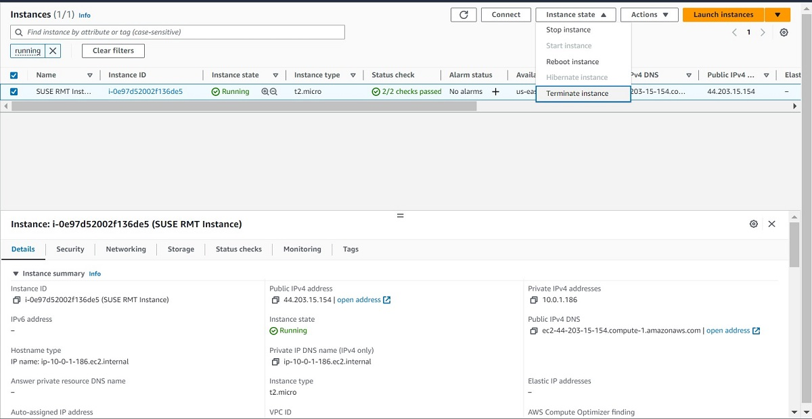
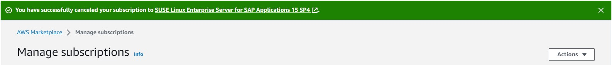

<!--
Copyright Amazon.com, Inc. or its affiliates. All Rights Reserved.
SPDX-License-Identifier: MIT-0
-->

### Activity 1: Cleanup

#### Step 1: Delete Marketplace EC2 Instance

Navigate to the [EC2 Instance dashboard](https://us-east-1.console.aws.amazon.com/ec2/home?region=us-east-1#Instances:instanceState=running), and select the instance that you launched with the Marketplace subscription. You will then go to the "Instance State" dropdown in the top right, and select "Terminate Instance". Confirm that you want to terminate it, and then it will notify you that it successfully terminated at the top of your screen.

#### Step 2: Cancel Marketplace Subscription

Next, you will cancel the Marketplace subscription. To do so, navigate to the [Marketplace Subscription dashboard](https://us-east-1.console.aws.amazon.com/marketplace/home#/subscriptions), and then select "Manage subscriptions" from the left-hand menu. Click on the "SUSE Linux Enterprise Server for SAP Applications 15 SP4" that you bought for this lab, and then click on the "Actions" dropdown menu in the Agreement section. From that menu select "Cancel subscription", and then confirm that you wish to delete the subscription.

**End of Task**