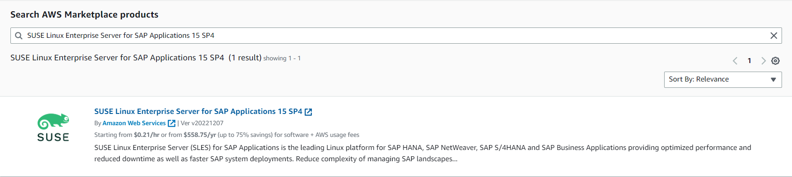
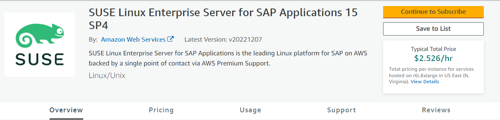
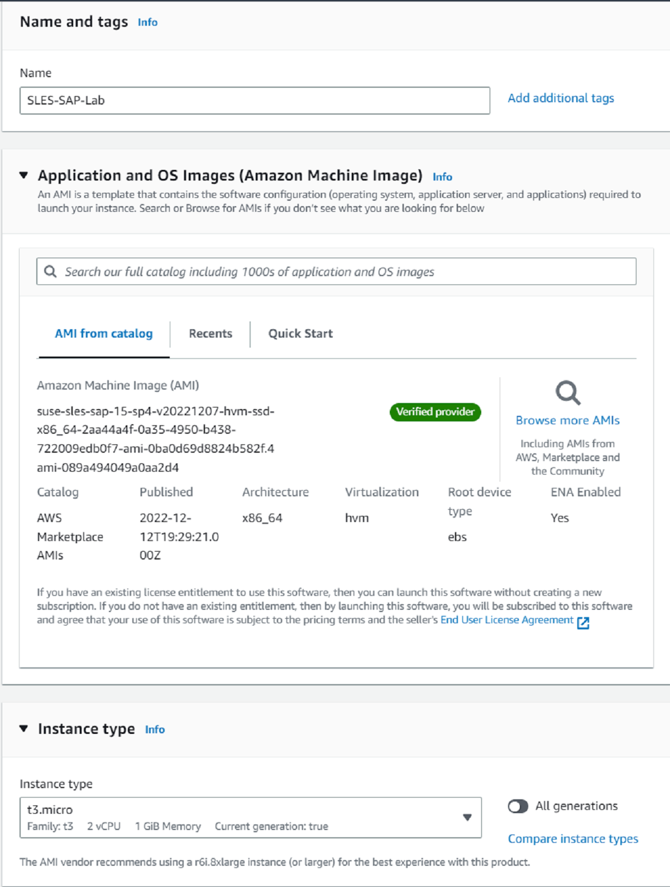
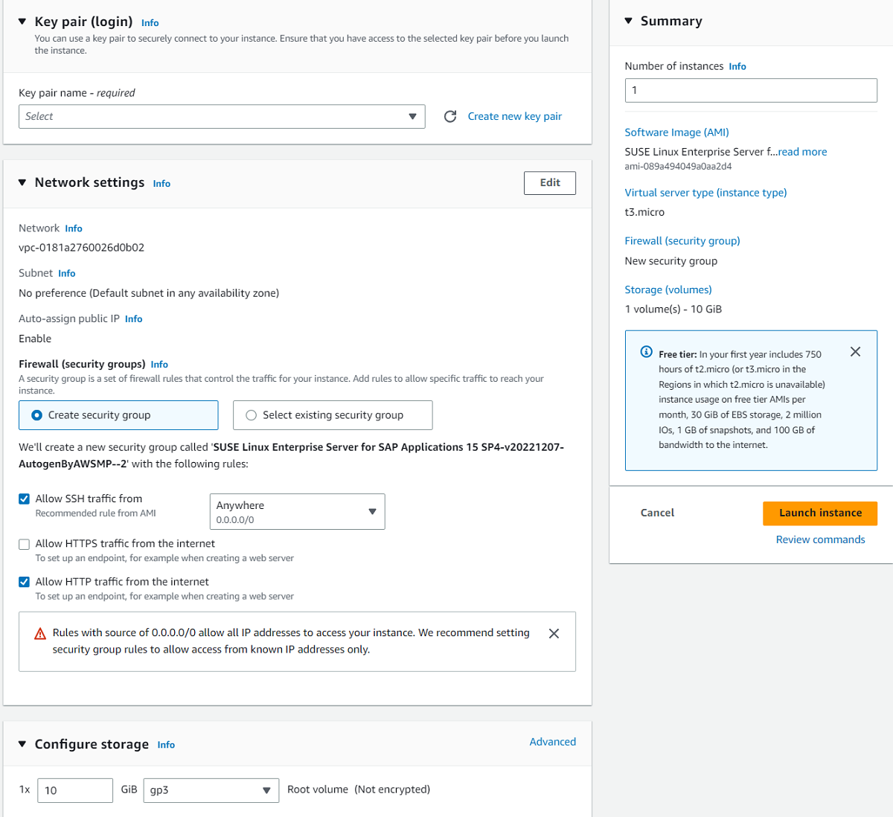

<!--
Copyright Amazon.com, Inc. or its affiliates. All Rights Reserved.
SPDX-License-Identifier: MIT-0
-->

In this lab you will launch a SLES for SAP instance through an AWS Marketplace subscription. This will allow you to implement live patching on the instance,
which automatically addresses severe kernel vulnerabilities with no downtime. In other words, it is an excellent solution for patching between regular patching cycles. 

### Prerequisites Checklist
- AWS Infrastructure Requirements (many of these requirements can be satisfied with the default VPC)
    - VPC
    - Public Subnet
    - Internet Gateway
    - Routing Table
    - Security Group
    - Key Pair
    - Public Instance
- Workstation to access the environment, including a browser and Terminal session.

### Activity 1: Launch a SLES for SAP instance through a Marketplace subscription
Navigate to [AWS Marketplace Subscriptions](https://us-east-1.console.aws.amazon.com/marketplace/home?region=us-east-1#/landing) in the console

Click on discover products in the left-hand menu.

Search for ‘SUSE Linux Enterprise Server for SAP Applications 15 sp4’ and choose the subscription shown below

Click **Continue to Subscribe**.

After AWS processes your subscription, click **Continue to Configuration**.

Check to make sure that it is launching in the North Virginia/us-east-1 region, and then click **Continue to Launch**.

In the "Choose Action" section, select "Launch through EC2" and click **Launch**.

Name it:
- Name: Live Patching Lab

Choose t3.micro for the instance type for this lab.
- If t3.micro is unavailable you can also use t2.micro, or t3.small (In regions where t2.micro isn't available, the t3.micro equivalent is supported under the AWS Free Tier as well)

Create a keypair to use, or select one you already have.

You can use the default VPC and subnet, but ensure that Auto-assign public IP is enabled

The security group should already be configured, but make sure that it allows in traffic to ports 22 & 80 (SSH & HTTP)

Leave the storage as default

Launch Instance

::expand[]{header="Help: Screenshots"}

### Activity 2: Enabling Live Patching

#### Task 1: Install Live Patching Pattern

After the instance has deployed successfully, ssh onto the instance.

Using a terminal, run the following command (replacing the .pem file with the path to yours, and the IP with your instance’s public IP)

:::code{showCopyAction=true showLineNumbers=true}
ssh i "CLIPractice.pem" ec2user@ec2384940.compute1.amazonaws.com
:::

After connecting to the instance successfully, run:
    
:::code{showCopyAction=true showLineNumbers=true}
sudo SUSEConnect
:::
    
This will connect your instance to the SUSE public cloud update infrastructure

Then install the live patching pattern: 

:::code{showCopyAction=true showLineNumbers=true}
sudo zypper install -t pattern lp_sles
:::

:::code{showCopyAction=false showLineNumbers=true}
ec2user@ip172319346:~> sudo zypper install t pattern lp_sles
Refreshing service 'Basesystem_Module_x86_64'.
Refreshing service 'Containers_Module_x86_64'.
Refreshing service 'Desktop_Applications_Module_x86_64'.
Refreshing service 'Development_Tools_Module_x86_64'.
Refreshing service 'Legacy_Module_x86_64'.
Refreshing service 'Public_Cloud_Module_x86_64'.
Refreshing service 'Python_3_Module_x86_64'.
Refreshing service 'SAP_Applications_Module_x86_64'.
Refreshing service 'SUSE_Linux_Enterprise_High_Availability_Extension_x86_64'.
Refreshing service 'SUSE_Linux_Enterprise_Live_Patching_x86_64'.
Refreshing service 'SUSE_Linux_Enterprise_Server_for_SAP_Applications_x86_64'.
Refreshing service 'Server_Applications_Module_x86_64'.
Refreshing service 'Web_and_Scripting_Module_x86_64'.
Building repository 'SLEModuleBasesystem15SP4Pool' cache .....................................................[done]
...
:::

This will install the pattern (collection of modules) needed to run live patching on your instance

Enter y to proceed

:::code{showCopyAction=false showLineNumbers=true}
Building repository 'SLEModuleWebScripting15SP4Updates' cache ...............................................[done]
Loading repository data...
Reading installed packages...
Resolving package dependencies...

The following 3 NEW packages are going to be installed:
kernellivepatch5_14_21150400_24_33default kernellivepatchtools patternslplp_sles

The following NEW pattern is going to be installed:
lp_sles

3 new packages to install.
Overall download size: 140.5 KiB. Already cached: 0 B. After the operation, additional 296.4 KiB will be used.
Continue? [y/n/v/...? shows all options] (y): y
Retrieving package kernellivepatchtools1.2150400.15.3.1.x86_64 (1/3), 28.3 KiB ( 33.0 KiB unpacked)
Retrieving: kernellivepatchtools1.2150400.15.3.1.x86_64.rpm ..................................................[done]
...
:::

#### Task 2: Check Live Patching Status
Check the status of live patching: 

:::code{showCopyAction=true showLineNumbers=true}
klp -v status
:::

:::code{showCopyAction=false showLineNumbers=true}
ec2user@ip172319346:~> klp v status
ready
:::

The instance is now configured to run Kernel live patches as part of regular system updates.

Check what patch is currently installed on your system:

:::code{showCopyAction=true showLineNumbers=true}
klp -v patches
:::

:::code{showCopyAction=false showLineNumbers=true}
ec2user@ip172319346:~> klp v patches
livepatch_6_150400_2_2
    active: 1
    RPM: kernellivepatch5_14_21150400_24_33default6150400.2.2.x86_64
    CVE: CVE202326545 CVE20231652 CVE20231118 CVE20231078 CVE20230590 CVE20230266 CVE20230179 CVE202243945 CVE20224379 CVE20224378 CVE20224139 CVE20222602 CVE202139698
    bug fixes and enhancements: (none)
:::

**End of Lab**